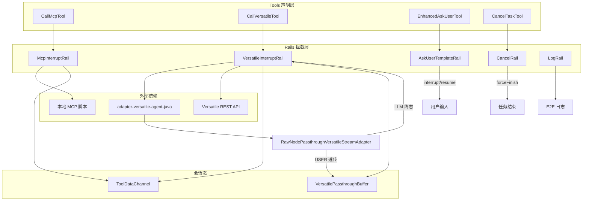

# EDPAgent Rails 与 Versatile Adapter 测试设计

> 基于 `edp-agent-java` 中 Rails/Tools 实现与 `adapter-versatile-agent-java` 透传适配器整理。
>
> **本文档覆盖 EDPAgent 的“工具拦截增强层”与 Versatile 工作流代理层**。Tools 只声明 LLM 可调用的参数 schema；Rails 在工具调用前后拦截并执行真实业务（脚本执行、VA 委托、用户中断、取消收尾、观测日志）；Adapter 负责 Versatile SSE 节点的 USER/LLM 分流与全维度透传。

> **内测说明**：以下三个特性当前仍在**内测中**，接口、配置与验收标准可能随迭代调整；本文相关章节仅描述当前 spike 实现，正式能力以发布说明为准。
>
> | 特性 | 涉及模块/配置 | 当前状态 |
> |---|---|---|
> | **Redis** | 会话持久化、checkpoint 释放、ToolDataChannel 跨重启（如有接入） | 内测中，本文默认按内存通道验证 |
> | **沙箱** | `call_mcp` / `McpInterruptRail` 本地脚本执行、`script_command` 路径解析 | 内测中，当前为 Process 本地执行 spike |
> | **话术** | `ask_user` / `AskUserTemplateRail`、`ScriptsConfig.yaml`、`utterances.config_path`、响应模板 | 内测中，部分路径仅记录配置、返回固定话术 |

## 1. 背景与目标

### 背景

- 当前问题：EDPAgent 的业务能力不是“工具函数直接返回”这么简单。以理财场景为例，一次完整流程通常包含：
  1. `call_mcp` 本地执行推荐脚本，产出结构化产品列表；
  2. `call_versatile` 委托 Versatile 工作流完成购买/资金筹划，期间可能弹出菜单卡片等待用户确认；
  3. `ask_user` 在关键节点向用户追问或确认；
  4. `cancel_task` 在用户明确取消后结束当前任务。
- 如果没有 Rails 拦截层，Tools 只能返回占位 intent，无法执行脚本、无法直连 Versatile、无法触发 OpenJiuwen interrupt 续传、无法在取消后合法结束 ReAct 链路。
- 如果没有 Adapter 透传层，Versatile 返回的 `menu_type`/`node_type`/`node_name` 等字段会在框架默认解析中被降维丢失，前端 A2A 无法渲染菜单卡片。
- 影响范围：
  - **edp-agent-java**：`McpInterruptRail`、`VersatileInterruptRail`、`AskUserTemplateRail`、`CancelRail`、`LogRail` 及对应 Tools；
  - **adapter-versatile-agent-java**：`RawNodePassthroughVersatileStreamAdapter`、`MenuPassthroughVersatileStreamAdapter`、`VersatileAgentConfiguration`；
  - **跨模块协作**：`VersatileInterruptRail` ↔ adapter A2A ↔ `EdpaRuntimeHandler` 透传缓冲续传。
- 需求来源：Java 版 EDPAgent 对齐 Python EDPA 的 MCP 沙箱、VA 委托、ask_user 中断、cancel 收尾、E2E 观测，以及 Versatile 菜单节点全维度透传。

一个最简单的端到端例子：

```text
用户：帮我推荐理财产品
  ↓
Agent 调用 call_mcp → McpInterruptRail 本地执行脚本 → 写入 ToolDataChannel
  ↓
用户：买第一支，金额 5000
  ↓
Agent 调用 call_versatile(input_key=...) → VersatileInterruptRail 读取通道并 POST adapter A2A
  ↓
Adapter 透传 menu 节点 → VersatileInterruptRail 抛出 INPUT_REQUIRED 中断
  ↓
用户确认菜单 → 续传 call_versatile → 返回终态结果
```

> **工具间数据通道**（`result_key` / `input_key` 读写）的专项测试设计见同目录 [`EDPAgent工具间数据通道转测试设计.md`](./EDPAgent工具间数据通道转测试设计.md)。本文在 MCP/VA Rail 章节仅标注与数据通道的衔接点，不重复展开。

### 目标

| 能力域 | 系统需要保证 |
|---|---|
| MCP 脚本调用 | `call_mcp` 被 Rail 拦截后真实执行本地脚本，stdout JSON 归一化为 tool_result，并按规则写入 ToolDataChannel |
| Versatile 委托 | `call_versatile` 优先走 adapter A2A SSE，解析 USER 透传节点与 LLM 终态；INPUT_REQUIRED 时中断并可续传 |
| 用户追问 | `ask_user` 首次调用抛出 ToolInterruptException；用户回复后 Rail 回填 tool_result，不再重复中断 |
| 任务取消 | `cancel_task` 工具函数先执行完毕，CancelRail 在 afterToolCall 触发 forceFinish，消息序列合法 |
| 观测日志 | LogRail 记录模型输入/输出/token 用量及工具完成事件，支撑 E2E 穿刺证据 |
| Adapter 透传 | 非结果节点的完整 Versatile message JSON 以 Target.USER 透传；结果节点汇总为 Target.LLM 终态 |

### 非目标

- 不测试具体业务脚本推荐算法、Versatile 工作流业务正确性、大模型推理质量。
- 不测试 `lite_todo_write`、`ExecutionLimitRail` 等非本文负责模块（由其他同事覆盖）。
- 不要求本轮验证 Versatile 生产环境高可用、限流、熔断（仅验证调用链路与错误降级）。
- 不测试前端菜单 UI 渲染细节，只验证透传 JSON 是否保留 `menu_type` 等关键字段。

## 2. 场景、规则与约束

### 核心场景

#### 2.1 MCP 脚本调用（McpInterruptRail + CallMcpTool）

| 场景 | 触发条件 | 预期结果 |
|---|---|---|
| 正常脚本执行 | `call_mcp` 传入有效 `script_command` 与 `script_params` | Rail 设置 `_skip_tool`，本地 Process 执行脚本，stdout 最后一行 JSON 解析为 tool_result |
| 脚本超时 | 脚本执行超过 60s | 返回 `status=failed`，含 `mcp_error` 超时说明，不写入脏数据 |
| 脚本非零退出 | exitCode ≠ 0 | 返回 failed 结构，含 stderr 摘要 |
| stdout 非 JSON | 脚本输出无法解析 | 返回 failed，不写入 ToolDataChannel |
| script_command 为空 | 参数缺失 | 返回 failed，不启动进程 |
| 相对路径脚本解析 | `python script.py` 且 skillsDir 已配置 | 按 skillsDir → cwd → 默认 scenarios 路径顺序解析 |
| 结果写入通道 | 脚本输出含 `result_key` 或默认 key | afterToolCall 写入 ToolDataChannel（详见数据通道文档） |
| 非 call_mcp 工具 | toolName ≠ call_mcp | Rail 直接放行，不拦截 |

**场景示例：正常 MCP 调用**

工具入参：

```json
{
  "script_command": "python product_recommend_skill/main.py",
  "script_params": {"risk_level": "R2", "keyword": "固收"}
}
```

Rail 行为：

```text
beforeToolCall: 拦截 call_mcp → 启动进程 → SKILL_INPUT=script_params JSON
afterToolCall: 解析 result → 写入 ToolDataChannel → 清理 control 字段后刷新 toolMsg
```

#### 2.2 Versatile 委托（VersatileInterruptRail + CallVersatileTool + Adapter）

| 场景 | 触发条件 | 预期结果 |
|---|---|---|
| Adapter A2A 优先 | `adapter_a2a_url` 已配置 | POST SendStreamingMessage，Accept: text/event-stream |
| REST 直连降级 | 无 adapter URL，仅有 `versatile.url` | POST REST body `{inputs, stream:true}` |
| 配置缺失 | versatile 配置为空 | 返回 `status=failed`，不抛未捕获异常 |
| input_key 命中 | 参数含 `input_key` 且通道有数据 | `buildInputs` 注入 `input_data` / `business_data` |
| input_key 未命中 | key 不存在或大小写不一致 | 注入空 Map，记录 warning，流程继续 |
| query 自动补全 | `query_description` 为空且通道有 `mcp_to_versatile_information` | 自动填充 query |
| INPUT_REQUIRED 中断 | adapter 返回 TASK_STATE_INPUT_REQUIRED | 抛出 ToolInterruptException，透传节点先入缓冲 |
| 续传恢复 | extra 含 RESUME_USER_INPUT_KEY | 跳过 adapter 调用，直接回填 tool_result |
| HTTP 4xx/5xx | adapter/REST 返回错误状态码 | 返回 failed 结构，含 HTTP 状态与 body 摘要 |
| 透传缓冲 | adapter 响应含 artifactUpdate 文本 | 写入 VersatilePassthroughBuffer，供 handler FIFO 刷出 |

**场景示例：菜单确认中断与续传**

```text
1. call_versatile → adapter 返回 passthrough_nodes=[菜单 JSON] + status=input_required
2. VersatileInterruptRail 写入 passthroughBuffer，抛出 ToolInterruptException
3. EdpaRuntimeHandler 刷出 USER 节点，前端展示菜单
4. 用户确认 → handler 构造 InteractiveInput → 续传 call_versatile
5. Rail 检测到 resumeInput → 回填 completed tool_result，不再调 adapter
```

#### 2.3 用户追问（AskUserTemplateRail + EnhancedAskUserTool）

| 场景 | 触发条件 | 预期结果 |
|---|---|---|
| 首次 ask_user | 模型发起 ask_user tool_call | Rail 抛出 ToolInterruptException，message 为 question |
| question 缺失 | 参数无 question | 使用默认话术“需要您确认以下信息”或 utterances 配置路径日志 |
| 续传恢复 | extra 含用户 answer | 设置 `_skip_tool`，tool_result 含 `user_responded` 与 `user_response` |
| 非 ask_user 工具 | toolName ≠ ask_user | Rail 直接放行 |
| 参数 JSON 字符串 | toolArgs 为 JSON 字符串 | normalizeArgs 解析为 Map |

#### 2.4 任务取消（CancelRail + CancelTaskTool）

| 场景 | 触发条件 | 预期结果 |
|---|---|---|
| 正常取消 | cancel_task 工具函数执行完毕 | afterToolCall 触发 requestForceFinish，输出固定取消话术 |
| checkpoint 清理标记 | cancel_task 被拦截 | extra 写入 `_edp_checkpoint_release=true` |
| 消息序列合法 | cancel 在 afterToolCall 而非 beforeToolCall | tool_call 已有对应 tool_response，forceFinish 后不触发非法 LLM 调用 |
| 非 cancel_task | 其他工具 | Rail 直接放行 |

#### 2.5 观测日志（LogRail）

| 场景 | 触发条件 | 预期结果 |
|---|---|---|
| 模型调用前 | beforeModelCall | 日志含 messageCount、lastMessage |
| 模型调用后 | afterModelCall + AssistantMessage | 日志含 E2E_MODEL_OUTPUT、E2E_MODEL_USAGE（input/output/total tokens） |
| 工具调用后 | afterToolCall | 日志含 toolName |

#### 2.6 Adapter 透传（adapter-versatile-agent-java）

| 场景 | 触发条件 | 预期结果 |
|---|---|---|
| 普通 message 节点 | event=message 且非结果节点 | Target.USER，内容为完整 `{"event":"message","data":{...}}` JSON |
| 结果节点抑制 | node_type/node_name 命中配置 | 不参与 USER 透传，文本汇总到 LLM 终态 |
| 裸 node 包装 | 帧无 event 但含 node_type/menu_type | 自动补 `event=message` + `data` 包装 |
| 菜单全维度透传 | message.data 含 menu_type | MenuPassthrough 将 data.text 改写为整段 data JSON |
| workflow_finished / end | 工作流结束事件 | Target.LLM completed，汇总 resultTexts |
| connection_closed 无 End | 断连且未收到 End 节点 | Target.USER interrupted，非 completed |
| exception 事件 | Versatile 异常帧 | Target.FAILED，含 VERSATILE_ 前缀错误码 |
| 解析失败 | SSE 行非法 JSON | 跳过该行，不中断流 |

### 关键规则

| 规则 | 说明 |
|---|---|
| Tool 声明 / Rail 执行分离 | Tools 只返回 intent 占位；真实执行、中断、通道读写均由对应 Rail 负责 |
| `_skip_tool` 标记 | Rail 拦截后设置 extra `_skip_tool=true`，避免框架重复执行工具函数 |
| 取消时机规则 | CancelRail 必须在 **afterToolCall** 拦截，保证 tool_response 已写入消息序列 |
| interrupt 续传规则 | 恢复输入从 `ToolInterruptionState.RESUME_USER_INPUT_KEY` 读取，优先按 toolCallId 精确匹配 |
| Adapter 优先规则 | 同时配置 adapter A2A URL 与 REST URL 时，优先 adapter A2A |
| 结果节点双命中规则 | `resultNodeType` 与 `resultNodeName` 同时匹配才视为终态结果节点 |
| 大小写敏感（数据通道） | input_key / result_key 严格匹配，详见数据通道文档 |
| 优先级规则 | CancelRail(10) < MCP/VA/ask_user(50) < LogRail(1000) |

### 关键约束

| 约束 | 说明 | 影响 |
|---|---|---|
| 脚本执行环境依赖 | MCP 需要本机 Python/脚本文件可执行 | 集成测试需准备 mock 脚本或 wealth-demo skills |
| Versatile 外部依赖 | VA/adapter 需可访问的 HTTP 端点 | 集成测试可用 WireMock 或本地 adapter 进程 |
| 共享 ToolDataChannel | MCP 写、VA 读须注入同一 channel 实例 | EdpaAgentEnhancer 构造时须共享 Bean |
| 共享 PassthroughBuffer | Rail 写、Handler 读须同一 buffer 实例 | enhance() 与 handler 须注入同一对象 |
| 脚本超时 60s | McpInterruptRail.SCRIPT_TIMEOUT 固定 | 长脚本测试需 mock 或调短超时（单测） |
| SSE 解析边界 | A2A 响应按行解析 `data:` 前缀 | 需覆盖多帧、空帧、[DONE] 行 |
| 敏感数据 | MCP 结果、VA 响应可能含业务/认证信息 | 日志 abbreviate 截断，E2E 日志需脱敏检查 |

### 待确认点

| 问题 | 影响 | 当前处理 |
|---|---|---|
| AskUserTemplateRail 与 EnhancedAskUserTool 双入口 | ask_user 中断由 Tool 还是 Rail 触发 | 当前 Tool 也抛 interrupt，Rail 在 beforeToolCall 二次处理；测试需验证不重复中断 |
| failed MCP 默认 versatile_query | 脚本失败时仍带默认 query | 测试需确认失败场景是否应写入通道 |
| MenuPassthrough 与 RawNodePassthrough 关系 | Configuration 当前只用 RawNode | MenuPassthrough 为备选/legacy，测试范围需确认是否仍启用 |
| Versatile 续传 menu_confirm 字段提取 | handler 与 Rail 字段约定 | 以 EdpaRuntimeHandlerVersatileContinuationTest 为准 |
| cancel 后 checkpoint 释放时机 | `_edp_checkpoint_release` 由谁消费 | 测试需与 handler 层联调验证 |

## 3. 总体方案

### 方案概述

1. **Tools 层**：`CallMcpTool`、`CallVersatileTool`、`EnhancedAskUserTool`、`CancelTaskTool` 向 LLM 暴露参数 schema 与工具描述。
2. **Rails 层**：在 OpenJiuwen DeepAgent 回调链中按优先级拦截工具调用，执行脚本、HTTP 委托、interrupt、forceFinish、日志。
3. **Adapter 层**：`adapter-versatile-agent-java` 注册为 A2A Handler，通过 `RawNodePassthroughVersatileStreamAdapter` 将 Versatile SSE 分流为 USER 透传与 LLM 终态。
4. **协作层**：`VersatileInterruptRail.VersatilePassthroughBuffer` 与 `EdpaRuntimeHandler` 共享，保证菜单节点在 DeepAgent 帧之间 FIFO 刷出。

```text
LLM tool_call
    ↓
Tools（schema 声明，部分抛 interrupt）
    ↓
Rails（beforeToolCall / afterToolCall 拦截增强）
    ↓
外部系统（本地脚本 / adapter A2A / Versatile REST）
    ↓
ToolDataChannel / PassthroughBuffer / forceFinish
    ↓
Runtime Handler 流式输出 → 前端 A2A
```

### 链路图



#### 完整流程示例：推荐 → 购买 → 菜单确认

```text
1. 用户：推荐理财产品
2. call_mcp → McpInterruptRail 执行推荐脚本 → 写入 fund_recommend_result
3. 用户：买第一支 5000 元
4. call_versatile(input_key=fund_recommend_result) → VersatileInterruptRail 读通道 → POST adapter
5. adapter RawNodePassthrough 透传 TRANSFER_MENU 节点 → Rail 中断
6. handler 刷出菜单 JSON → 前端渲染
7. 用户确认 → 续传 call_versatile → 返回 completed
8. 若用户说“取消” → ask_user 确认 → cancel_task → CancelRail forceFinish
```

### 模块分工

| 模块 | 职责 | 输入 | 输出 |
|---|---|---|---|
| `CallMcpTool` | 声明 MCP 脚本调用 schema | script_command, script_params | mcp_intent 占位 |
| `McpInterruptRail` | 本地脚本执行 + 通道写入 | toolArgs, 脚本 stdout | tool_result, ToolDataChannel |
| `CallVersatileTool` | 声明 VA 委托 schema | query_description, input_key 等 | delegate_intent 占位 |
| `VersatileInterruptRail` | VA 委托 + 中断续传 + 通道读取 | toolArgs, adapter SSE | tool_result / ToolInterruptException |
| `VersatilePassthroughBuffer` | 会话级 USER 节点 FIFO 队列 | passthrough_nodes | poll/hasPending |
| `EnhancedAskUserTool` | 声明 ask_user schema + 抛 interrupt | question, template keys | ToolInterruptException |
| `AskUserTemplateRail` | ask_user 话术增强 + 续传回填 | toolArgs, resumeInput | interrupt / tool_result |
| `CancelTaskTool` | 声明取消 schema | reason | cancelled 占位 |
| `CancelRail` | 取消后 forceFinish + checkpoint 标记 | cancel_task 完成事件 | forceFinish message |
| `LogRail` | E2E 观测日志 | ModelCallInputs, ToolCallInputs | SLF4J 日志 |
| `RawNodePassthroughVersatileStreamAdapter` | Versatile SSE → USER/LLM 分流 | raw SSE lines | AgentExecutionResult 流 |
| `MenuPassthroughVersatileStreamAdapter` | 菜单节点 text 全维度改写 | 含 menu_type 的 message 行 | 改写后的 SSE 行 |
| `VersatileAgentConfiguration` | 注册 A2A Handler Bean | VersatileProperties | AgentRuntimeHandler |

## 4. 关键设计

| 设计点 | 处理方式 | 异常/边界 |
|---|---|---|
| MCP 脚本执行 | ProcessBuilder + SKILL_INPUT 环境变量 | 超时 destroyForcibly、stderr 摘要 |
| stdout JSON 提取 | 取最后一行 `{...}` | 多行日志 + 末行 JSON |
| MCP 控制字段清理 | removeControlFields 去掉 result_key 等 | toolMsg 同步刷新 |
| VA adapter A2A | SendStreamingMessage + SSE 解析 | HTTP 错误 → failedResult |
| A2A 帧解析 | artifactUpdate→USER，statusUpdate→LLM | 空帧、[DONE] 跳过 |
| input_key 未命中 | 注入空 Map `{}` | warning 日志，不中断 |
| INPUT_REQUIRED | passthroughBuffer.rememberInterruptId + throw | 续传按 toolCallId 匹配 |
| ask_user 默认话术 | resolveUtterance 读 utterances.config_path | 当前返回固定话术 |
| cancel forceFinish | afterToolCall 时机 | 避免 HTTP 400 消息序列错误 |
| Adapter 结果节点 | isResultNode 双字段匹配 | 结果只进 LLM，不重复 USER 透传 |
| 裸 node 兼容 | looksLikeRawNode 自动包装 event/data | mock/网关兼容 |

### 接口说明

| 接口/调用 | 类型 | 调用方 | 入参要点 | 出参/事件 | 错误或异常 |
|---|---|---|---|---|---|
| `call_mcp` | SDK Tool | LLM | script_command(必填), script_params | mcp_intent → Rail 替换为真实 result | 脚本失败 status=failed |
| `call_versatile` | SDK Tool | LLM | query_description, query_intent(必填), input_key | delegate_intent → Rail 替换 | failed / input_required |
| `ask_user` | SDK Tool | LLM | question(必填) | ToolInterruptException | 续传 user_responded |
| `cancel_task` | SDK Tool | LLM | reason(可选) | cancelled → CancelRail forceFinish | 无 |
| adapter SendStreamingMessage | A2A JSON-RPC | VersatileInterruptRail | metadata.versatile.inputs | SSE data: 帧 | HTTP ≥400 |
| Versatile REST POST | HTTP | VersatileInterruptRail | {inputs, stream:true} | JSON/SSE body | HTTP ≥400 |
| ToolDataChannel.store/get | Java 内部 | MCP/VA Rail | ToolDataKey, key | 数据或 null | 见数据通道文档 |
| VersatilePassthroughBuffer | Java 内部 | VA Rail / Handler | conversationId, nodes | poll FIFO | 空则 null |

#### 接口示例

**call_mcp 工具 schema（LLM 可见）**

```json
{
  "script_command": "python product_recommend_skill/main.py",
  "script_params": {"risk_level": "R2"}
}
```

**call_versatile 委托请求体（Rail 构造）**

```json
{
  "query": "购买第一支理财产品，金额5000元",
  "query_description": "购买第一支理财产品，金额5000元",
  "query_intent": "理财购买",
  "input_key": "fund_recommend_result",
  "input_data": {"products": [{"name": "稳健理财A"}]},
  "business_data": {"products": [{"name": "稳健理财A"}]}
}
```

**adapter A2A 透传节点（USER 目标）**

```json
{
  "event": "message",
  "data": {
    "node_type": "Menu",
    "node_name": "transfer_confirm",
    "menu_type": "TRANSFER_MENU",
    "text": "请确认转账信息"
  }
}
```

**ask_user 续传 tool_result**

```json
{
  "tool": "ask_user",
  "status": "user_responded",
  "user_response": {"answer": "确认购买"}
}
```

### 配置说明

| 配置项 | 所在位置 | 默认值 | 影响范围 |
|---|---|---|---|
| `versatile.url` | edp-agent.yaml | localhost:30001 REST | VA REST 直连 |
| `versatile.adapter_a2a_url` | edp-agent.yaml | localhost:8191/a2a | 优先 A2A 调用 |
| `versatile.timeout` | edp-agent.yaml | 30s | HTTP 连接/读取超时 |
| `versatile.url_variables` | edp-agent.yaml | workflow_id 等 | URL 占位符替换 |
| `versatile.result-node-name` | adapter application.properties | 空 | 结果节点 node_name |
| `versatile.result-node-type` | VersatileProperties | 配置驱动 | 结果节点 node_type |
| `edpConfig.utterances.config_path` | edp-config.yaml | ScriptsConfig 路径 | ask_user 话术（预留） |
| MCP SCRIPT_TIMEOUT | McpInterruptRail 常量 | 60s | 脚本执行超时 |

## 5. 可观测性

### 观测点

| 观测点 | 日志关键字 / 字段 | 用途 |
|---|---|---|
| MCP 拦截 | `McpInterruptRail: intercepting call_mcp` | 确认 Rail 生效 |
| MCP 脚本执行 | `execute script command=`, `exitCode=` | 脚本成败、耗时 |
| MCP 通道写入 | `stored call_mcp result to ToolDataChannel` | resultKey、fields |
| VA 拦截 | `intercepting call_versatile` | 确认 VA Rail 生效 |
| VA adapter 调用 | `POST adapter A2A`, `adapter A2A status=` | HTTP 状态、body 摘要 |
| VA 通道读写 | `ToolDataChannel hit/miss` | input_key 命中情况 |
| VA 中断 | `adapter requested user input` | INPUT_REQUIRED |
| VA 续传 | `resuming call_versatile with adapter result` | 续传路径 |
| 透传缓冲 | `queued passthrough nodes conversationId= count=` | USER 节点入队 |
| ask_user 中断 | `interrupting ask_user tool call` | question、toolCallId |
| ask_user 续传 | `resuming ask_user with user input` | 用户已回复 |
| cancel 收尾 | `intercepting cancel_task after execution, force finish` | 取消话术 |
| E2E 模型 | `E2E_MODEL_INPUT`, `E2E_MODEL_OUTPUT`, `E2E_MODEL_USAGE` | 端到端证据 |
| 工具完成 | `LogRail: tool call completed, toolName=` | 工具级 trace |
| Adapter 结果节点 | `versatile result node suppressed` | 结果节点未重复透传 |
| Adapter 菜单 | `versatile menu node passthrough: menu_type=` | 菜单全维度改写 |

#### 推荐日志示例

```text
[McpInterruptRail] execute script command=[python, .../main.py], workDir=.../product_recommend_skill
[McpInterruptRail] stored call_mcp result to ToolDataChannel key=ToolDataKey(...), resultKey=fund_recommend_result, fields=[products, status]
[VersatileInterruptRail] ToolDataChannel hit key=ToolDataKey(...), input_key=fund_recommend_result
[VersatileInterruptRail] POST adapter A2A http://localhost:8191/a2a
[VersatileInterruptRail] adapter requested user input, toolCallId=call_abc123
[VersatileInterruptRail] queued passthrough nodes conversationId=session-1 count=1
[CancelRail] intercepting cancel_task after execution, force finish with message='好的，已为您取消...'
[E2E_MODEL_USAGE] inputTokens=1200, outputTokens=85, totalTokens=1285, model=deepseek-v4-pro
```

## 6. 测试建议

### 建议测试重点与开发自测门禁

#### 6.1 McpInterruptRail + CallMcpTool

| 前置/触发条件 | 建议测试重点 | 希望保证的结果 | 优先级 | 测试方式 | 开发自测门禁 |
|---|---|---|---|---|---|
| 有效 script_command | 本地脚本执行 | tool_result 含脚本 JSON 字段 | P0 | 单测(mock Process) / 集成 | 是 |
| script_command 为空 | 参数校验 | status=failed，不启动进程 | P0 | 单测 | 是 |
| 脚本 exitCode≠0 | 错误处理 | failed + mcp_error 含 stderr 摘要 | P0 | 单测 | 是 |
| 脚本超时 | 60s 边界 | destroyForcibly + 超时错误 | P1 | 单测(mock) | 否 |
| stdout 末行 JSON | 解析策略 | 多行输出取最后一行 `{...}` | P1 | 单测 | 否 |
| afterToolCall 写入通道 | result_key 存取 | 见数据通道文档 P0 用例 | P0 | 单测 | 是 |
| toolName≠call_mcp | 放行 | 不拦截、不写通道 | P1 | 单测 | 否 |
| CallMcpTool schema | 必填 script_command | LLM schema 正确注册 | P2 | 单测 | 否 |

#### 6.2 VersatileInterruptRail + CallVersatileTool + Adapter

| 前置/触发条件 | 建议测试重点 | 希望保证的结果 | 优先级 | 测试方式 | 开发自测门禁 |
|---|---|---|---|---|---|
| adapter_a2a_url 已配置 | A2A SSE 调用 | 解析 passthrough_nodes + content | P0 | 集成(WireMock) | 是 |
| input_key 命中/未命中 | 通道注入 | input_data 正确/空 Map | P0 | 单测(已有) | 是 |
| query_description 自动补全 | mcp_to_versatile_information | query 自动填充 | P1 | 单测(已有) | 否 |
| INPUT_REQUIRED | 中断抛出 | ToolInterruptException + buffer 入队 | P0 | 单测/集成 | 是 |
| 续传 resumeInput | 跳过 adapter | tool_result 回填，_skip_tool=true | P0 | 单测(已有) | 是 |
| versatile 配置缺失 | 降级 | status=failed | P0 | 单测 | 是 |
| HTTP 4xx/5xx | 错误降级 | failed + error 消息 | P1 | 单测(WireMock) | 否 |
| PassthroughBuffer FIFO | 多节点入队出队 | poll 顺序与 hasPending | P1 | 单测 | 否 |
| CallVersatileTool schema | 必填 query_description/query_intent | schema 含 input_key | P2 | 单测 | 否 |
| RawNodePassthrough 普通节点 | USER 透传 | 完整 JSON，含 node_type | P0 | 单测 | 是 |
| RawNodePassthrough 结果节点 | LLM 汇总 | 不 USER 重复透传 | P0 | 单测 | 是 |
| connection_closed 无 End | 中断非完成 | INTERRUPTED Target.USER | P1 | 单测 | 否 |
| MenuPassthrough menu_type | text 改写 | data.text 为整段 data JSON | P1 | 单测 | 否 |

#### 6.3 AskUserTemplateRail + EnhancedAskUserTool

| 前置/触发条件 | 建议测试重点 | 希望保证的结果 | 优先级 | 测试方式 | 开发自测门禁 |
|---|---|---|---|---|---|
| 首次 ask_user | 中断 | ToolInterruptException，message=question | P0 | 单测 | 是 |
| question 缺失 | 默认话术 | “需要您确认以下信息” | P1 | 单测 | 否 |
| 续传含 answer | 回填 tool_result | status=user_responded | P0 | 单测 | 是 |
| toolArgs JSON 字符串 | normalizeArgs | 正确解析 Map | P2 | 单测 | 否 |
| 非 ask_user 工具 | 放行 | 无 interrupt | P1 | 单测 | 否 |

#### 6.4 CancelRail + CancelTaskTool

| 前置/触发条件 | 建议测试重点 | 希望保证的结果 | 优先级 | 测试方式 | 开发自测门禁 |
|---|---|---|---|---|---|
| cancel_task afterToolCall | forceFinish | 固定取消话术输出 | P0 | 单测 | 是 |
| checkpoint 标记 | extra 写入 | `_edp_checkpoint_release=true` | P1 | 单测 | 否 |
| 消息序列 | tool_response 已存在 | forceFinish 后不触发 LLM 400 | P0 | 集成 | 是 |
| CancelTaskTool 描述 | 需先 ask_user 确认 | schema description 正确 | P2 | 人工 | 否 |

#### 6.5 LogRail

| 前置/触发条件 | 建议测试重点 | 希望保证的结果 | 优先级 | 测试方式 | 开发自测门禁 |
|---|---|---|---|---|---|
| beforeModelCall | 输入日志 | messageCount、lastMessage | P2 | 单测(log capture) | 否 |
| afterModelCall + usage | token 日志 | input/output/total tokens | P2 | 单测 | 否 |
| afterToolCall | 工具名日志 | toolName 正确 | P2 | 单测 | 否 |

### 建议测试用例示例

**用例 1：MCP 脚本正常执行并写入通道**

```text
前置：mock 脚本 stdout 末行 {"status":"success","result_key":"fund_recommend_result","products":[...]}
操作：beforeToolCall(call_mcp) → afterToolCall(call_mcp)
预期：tool_result 含 products；ToolDataChannel 可按 fund_recommend_result 读取；control 字段已清理
```

**用例 2：Versatile adapter 菜单中断与续传**

```text
前置：adapter 返回 SSE，含 artifactUpdate(菜单 JSON) + status=TASK_STATE_INPUT_REQUIRED
操作：beforeToolCall(call_versatile) → 捕获 ToolInterruptException → 模拟用户确认 → 再次 beforeToolCall(含 resumeInput)
预期：首次中断；passthroughBuffer 有节点；续传后 tool_result.status=completed，不再 POST adapter
```

**用例 3：ask_user 中断与恢复**

```text
前置：模型发起 ask_user(question="请确认是否购买")
操作：beforeToolCall → 捕获 interrupt → 注入 InteractiveInput(answer) → 再次 beforeToolCall
预期：首次 interrupt message 正确；续传 tool_result.status=user_responded
```

**用例 4：cancel_task 合法结束**

```text
前置：cancel_task 工具函数已返回 tool_response
操作：afterToolCall(cancel_task)
预期：requestForceFinish 被调用；输出取消话术；extra 含 _edp_checkpoint_release
```

**用例 5：Adapter 菜单节点全维度透传**

```text
前置：SSE 行 data:{"event":"message","data":{"menu_type":"TRANSFER_MENU","node_type":"Menu","text":"确认"}}
操作：RawNodePassthroughVersatileStreamAdapter.adapt
预期：Target.USER 输出完整 JSON，含 menu_type、node_type，非仅 text 字段
```

**用例 6：Adapter 结果节点不重复透传**

```text
前置：resultNodeType=End, resultNodeName=result；SSE message 节点命中
操作：RawNodePassthroughVersatileStreamAdapter.adapt 至 workflow_finished
预期：该节点不 USER 透传；终态 LLM content 汇总 resultTexts
```

**用例 7：Versatile 配置缺失降级**

```text
前置：versatileConfig=null
操作：beforeToolCall(call_versatile)
预期：tool_result.status=failed，error 含 "versatile config is missing"，无未捕获异常
```

**用例 8：input_key 大小写不一致（与数据通道文档联动）**

```text
前置：通道写入 fund_recommend_result
操作：call_versatile(input_key=Fund_Recommend_Result)
预期：input_data={}；warning 日志；adapter 仍被调用（若配置存在）
```

### 关键异常与边界

- MCP 脚本 stdout 为空或非 JSON 时，不应写入 ToolDataChannel 脏数据。
- Versatile HTTP 超时或连接失败时，应返回 failed 结构，不应导致 Agent 进程崩溃。
- adapter SSE 帧顺序错乱或含非法 JSON 行时，应跳过坏行并尽量产出部分结果。
- ask_user 与 EnhancedAskUserTool 若双抛 interrupt，需验证最终只产生一次用户等待。
- cancel_task 若在 beforeToolCall 拦截（错误实现），会导致消息序列不合法 → 集成测试必须覆盖 afterToolCall 时机。
- PassthroughBuffer 在 conversationId 为空时不入队；poll 空队列返回 null。
- 并发场景下同一 conversation 多次 call_versatile，buffer 应按 FIFO 顺序刷出，不丢不重。
- 日志中 MCP/VA 响应 body 应 abbreviate 截断，不打印完整敏感业务数据。

### 现有测试资产对照

| 已有测试类 | 覆盖范围 | 缺口建议 |
|---|---|---|
| `McpInterruptRailToolDataTest` | 通道写入、默认 key、非 MCP 忽略 | 补充脚本执行、失败、超时 |
| `VersatileInterruptRailToolDataTest` | input_key 命中/未命中、query 补全、续传 | 补充 A2A SSE 解析、INPUT_REQUIRED |
| `EdpaRuntimeHandlerVersatileContinuationTest` | 菜单续传字段提取 | 与 Rail buffer 联调 |
| `ToolDataChannelTest` | 通道存取隔离 | 见数据通道文档 |
| adapter 模块 | **暂无单测** | 新增 RawNode/MenuPassthrough 单测 |

### 集成测试建议环境

```text
1. 启动 adapter-versatile-agent-java（端口 8191）
2. 启动 edp-agent-java（或 WireMock 模拟 Versatile REST）
3. wealth-demo mock 脚本目录就绪
4. 配置 edp-agent.yaml versatile.adapter_a2a_url
5. 端到端：POST /v1/runs → 观察 MCP 执行 → VA 菜单透传 → 续传 → 取消
```

---

**文档维护**：实现变更时同步更新 §2 待确认点与 §6 现有测试资产对照表。
