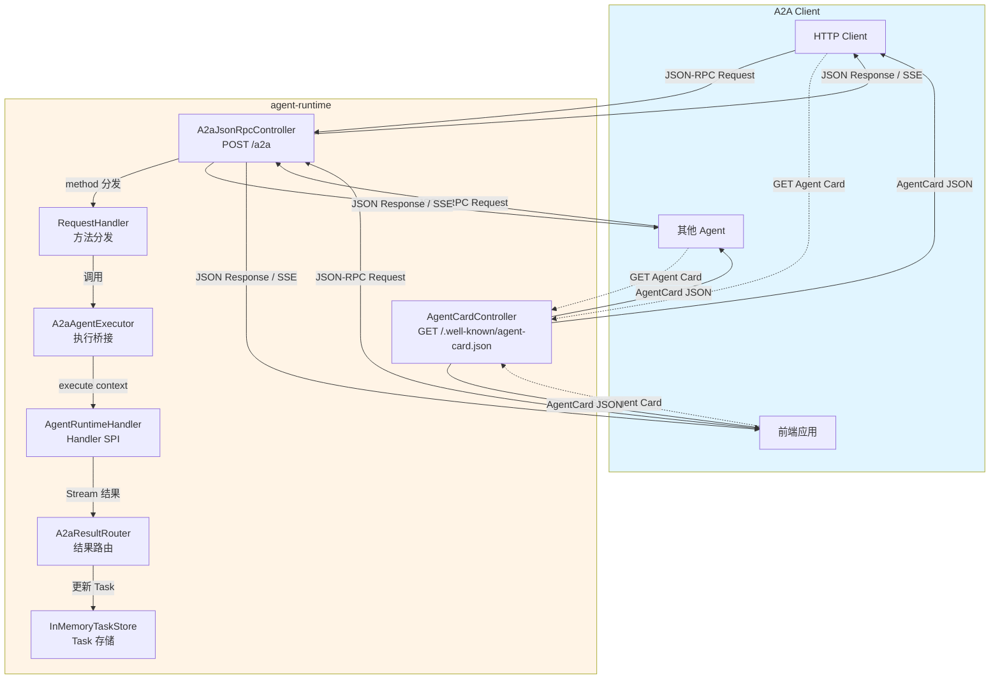

# A2A 协议标准支持 — 开发串讲文档

> 本文档基于模板整理，覆盖 agent-runtime 的 A2A 协议标准支持特性。
> 参考文档：[agent-runtime-core-features.cn.md](../architecture/docs/L1/agent-runtime/features/agent-runtime-core-features.cn.md)、[a2a-protocol-and-communication-design.md](../architecture/docs/L2/agent-runtime/a2a-protocol-and-communication-design.md)

---

## 1. 背景与目标

### 背景

- **当前问题**：Agent 需要一个标准化、可互操作的对外协议，以便其他 Agent、前端应用、CI/CD 流水线等任意 HTTP 客户端能够发现和调用 Agent。
- **影响范围**：所有需要对外暴露 Agent 的场景，包括跨 Agent 协作、前端集成、自动化流水线等。
- **需求来源**：Google A2A（Agent-to-Agent）协议标准支持要求。

### 目标

- 目标 1：对外暴露符合 Google A2A 协议标准的 JSON-RPC 服务端点，支持标准化的 Agent 发现和调用。
- 目标 2：实现三种 S2C 通讯模式（阻塞请求-响应、流式 SSE、异步 Task 查询），通过对应的 A2A 方法实现。
- 目标 3：提供 Agent Card 自动发现端点（`/.well-known/agent-card.json`），支持 YAML 配置、Handler 声明和自动生成。
- 目标 4：A2A 专有字段在协议适配层完成映射，不泄露到 runtime 内部，确保 runtime 核心以协议无关的方式工作。

### 非目标

- 非目标 1：本次不支持多 Agent 路由（每个 Agent 需部署独立 runtime 实例）。
- 非目标 2：本次不支持 Tenant 认证（runtime 仅传播 tenant header，不认证；多租户部署需在 `/a2a` 前放置认证网关）。
- 非目标 3：本次不激活 Push Notification 实际推送（SDK 组件已装配，推送功能未激活）。
- 非目标 4：本次不支持 gRPC 传输（当前仅支持 HTTP + SSE）。
- 非目标 5：本次不支持 A2A 方法名的 snake_case 形式（统一使用 CamelCase，如 `SendMessage`、`SendStreamingMessage`）。

---

## 2. 场景、规则与约束

### 核心场景

| 场景 | 触发条件 | 预期结果 |
|------|---------|---------|
| 发送消息并获取完整回复（同步） | 客户端调用 `SendMessage` 方法，Accept: application/json | 返回完整的 JSON Task 对象，状态为 COMPLETED 或 FAILED |
| 发送消息并获取流式回复 | 客户端调用 `SendStreamingMessage` 方法，Accept: text/event-stream | 通过 SSE 推送 TaskAccepted、ArtifactUpdate（多条）、TaskStatusUpdate 事件流 |
| 查询异步任务状态 | 客户端持有 taskId，调用 `GetTask` 方法 | 返回 JSON Task 对象，包含 status.state 和 artifacts |
| 取消正在执行的任务 | 客户端调用 `CancelTask` 方法，提供 taskId | 任务状态变为 CANCELED，SSE 流关闭 |
| 断线重连后重新订阅 | 客户端调用 `SubscribeToTask` 方法，提供 taskId | 恢复 SSE 流，继续接收后续 ArtifactUpdate 和 TaskStatusUpdate |
| 发现 Agent 能力 | 客户端访问 `GET /.well-known/agent-card.json` | 返回 AgentCard JSON，包含 name、description、skills、capabilities 等 |
| 创建/查询/删除 Push 配置 | 客户端调用对应的 Push Notification Config 方法 | 配置项 CRUD 操作成功（实际推送未激活） |
| 列出任务列表 | 客户端调用 `ListTasks` 方法 | 返回 JSON Task 数组，包含所有任务的基本信息（id、status、contextId 等） |

### 关键规则

| 规则 | 说明 |
|------|------|
| 单一入口 | 所有 A2A 方法通过 `POST /a2a` 统一入口，方法分发由 JSON-RPC `method` 字段驱动 |
| Agent Card 自动发现 | 标准 `GET /.well-known/agent-card.json` 端点，支持 YAML 配置、Handler 实现 AgentCardProvider 接口、自动生成三种方式 |
| Handler 始终 Stream | Handler 始终以 Stream 方式产出结果，`SendMessage` 的阻塞返回由 A2A 层收集 Stream 后一次性 JSON 响应实现 |
| 协议无关核心 | A2A 协议适配层负责 JSON-RPC 解析和 A2A 标准格式的响应序列化，runtime 核心以协议无关方式工作 |
| SSE 流终端状态关闭 | SSE 流在 INTERRUPTED / FAILED / CANCELED 终端状态下必须关闭 |
| JSON-RPC error 携带原 request id | 所有 JSON-RPC error response 必须携带原 request 的 `id` 字段 |
| Runtime 未就绪拒绝请求 | `RuntimeReadiness` gate 关闭时，拒绝所有 A2A 请求 |
| Tenant Header 优先级 | `X-Tenant-Id` HTTP header > `params.tenant` > `"default"` |

### 关键约束

| 约束 | 说明 | 影响 |
|------|------|------|
| 单一 Handler Bean | 当前仅选取第一个 Handler Bean，不支持多 Agent 路由 | 每个 Agent 需部署独立 runtime 实例 |
| Tenant 不认证 | runtime 不认证 tenant header，仅传播 | 多租户部署需在 `/a2a` 前放置认证网关 |
| Push Notification 未激活 | SDK 组件已装配，实际推送功能未激活 | Webhook 回调不可用，需使用 `GetTask` 轮询 |
| 仅 HTTP + SSE 传输 | 不支持 gRPC 传输 | 高性能场景受限 |
| 阻塞超时配置 | `SendMessage` 受 `a2a.blocking.agent.timeout.seconds`（默认 30s）和 `a2a.blocking.consumption.timeout.seconds`（默认 5s）限制 | Agent 执行超时后返回当前 task 快照 |
| Agent Card skills 非空才注册 | 只有 `skills` 非空的 Agent Card 才会被远程主 Agent 注册为 Tool | 如果 Agent 需被其他 Agent 调用，必须在 Agent Card 中声明至少一个 skill |

### 待确认点

| 问题 | 影响 | 当前处理 |
|------|------|---------|
| SendMessage 非完整 Agent 调用入口 | Agent 全流程以 `SendStreamingMessage` 为准 | 使用 `SendStreamingMessage` 作为主入口 |
| Push Notification 激活时间点 | Webhook 回调不可用 | 使用 `GetTask` 轮询，待后续激活 |
| gRPC 传输支持时间点 | 高性能场景受限 | 当前仅 HTTP + SSE，待后续规划 |

---

## 3. 总体方案

### 方案概述

1. **入口是什么**：单一 `POST /a2a` 端点（同时支持 `POST /a2a/`），所有 A2A 方法通过 JSON-RPC `method` 字段分发；Agent Card 发现通过两个标准端点：`GET /.well-known/agent-card.json`（标准端点）和 `GET /.well-known/agent.json`（兼容端点）。
2. **核心处理在哪里**：`A2aJsonRpcController` 负责 JSON-RPC 解析和方法分发，`RequestHandler` 处理具体方法，`A2aAgentExecutor` 桥接 A2A SDK AgentExecutor 与 Handler SPI，`A2aResultRouter` 将 Agent 执行结果路由到 A2A Task 表面。
3. **数据如何读写**：Handler 以 Stream 方式产出结果，A2aResultRouter 逐个消费并路由到 A2A Task 更新；SDK 默认组件 `InMemoryTaskStore` / `MainEventBus` / `InMemoryQueueManager` 管理任务生命周期。
4. **如何对用户或下游生效**：阻塞模式返回完整 JSON Task；流式模式通过 SSE 推送增量事件；异步模式通过 taskId 查询任务状态。

### 链路图 / 流程图



### 模块分工

| 模块 | 职责 | 输入 | 输出 |
|------|------|------|------|
| A2aJsonRpcController | JSON-RPC 解析、方法分发、阻塞/流式分支 | HTTP POST /a2a 请求 | JSON-RPC Response / SSE 流 |
| AgentCardController | Agent Card 发现端点 | HTTP GET /.well-known/agent-card.json | AgentCard JSON |
| RequestHandler | A2A 方法处理（SendMessage、SendStreamingMessage、GetTask 等） | JSON-RPC params | Task 对象 / SSE 事件流 |
| A2aAgentExecutor | A2A SDK AgentExecutor → Handler SPI 桥接 | AgentExecutionContext | Stream<AgentExecutionResult> |
| A2aResultRouter | Agent 执行结果 → A2A Task 表面路由 | AgentExecutionResult | Task 状态更新（OUTPUT / COMPLETED / FAILED / INTERRUPTED） |
| InMemoryTaskStore | Task 生命周期管理（SDK 默认） | Task CRUD 操作 | Task 对象持久化 |

---

## 4. 关键设计

| 设计点 | 处理方式 | 异常/边界 |
|--------|---------|----------|
| JSON-RPC 解析 | 使用 A2A SDK 的 `JSONRPCUtils.parseRequestBody()` | 非 JSON 请求体返回 parse error (`code: -32700`) |
| 方法分发 | 根据 JSON-RPC `method` 字段分发到阻塞分支或流式分支 | method 未知返回 method-not-found (`code: -32601`) |
| 阻塞/流式分支选择 | 根据 HTTP `Accept` 头判断：`application/json` → 阻塞，`text/event-stream` → 流式 | Accept 头不匹配时返回错误 |
| Agent Card 生成优先级 | 1) 直接注册的 AgentCard Bean；2) Handler 实现的 AgentCardProvider.describe()；3) YAML 配置；4) 自动生成 | 都不满足时使用默认值 |
| Handler 执行超时 | `a2a.blocking.agent.timeout.seconds`（默认 30s）+ `a2a.blocking.consumption.timeout.seconds`（默认 5s） | 超时后返回当前 task 快照（仍为 WORKING） |
| SSE 流关闭 | 在 INTERRUPTED / FAILED / CANCELED 终端状态后主动关闭 | 异常时追加一帧 SSE JSON-RPC error |
| Tenant 标识传播 | 从 `X-Tenant-Id` header 提取，传播到 MDC（contextId, taskId, tenantId, agentId） | 无 header 时使用 default-tenant-id |
| Task 状态流转 | SUBMITTED → WORKING → COMPLETED / FAILED / CANCELED / INPUT_REQUIRED | 状态只允许向前流转 |
| Agent Card skills 注册 | 只有 skills 非空的 Agent Card 才会被远程主 Agent 注册为 Tool | 无 skills 的 Agent 不会被其他 Agent 调用 |

### 接口说明

| 接口/调用 | 类型 | 调用方 | 入参要点 | 字段约束/默认值 | 出参/事件 | 错误或异常 |
|----------|------|--------|---------|----------------|----------|-----------|
| `POST /a2a` (SendMessage) | HTTP JSON-RPC | A2A Client | `method: SendMessage`，Accept: application/json | params.message 必填 | JSON Task 对象（status, artifacts） | Parse Error (`-32700`)、Invalid Request (`-32600`)、Method Not Found (`-32601`)、Internal Error (`-32603`) |
| `POST /a2a` (SendStreamingMessage) | HTTP SSE | A2A Client | `method: SendStreamingMessage`，Accept: text/event-stream | params.message 必填 | SSE 流：TaskAccepted → ArtifactUpdate (×N) → TaskStatusUpdate | SSE 流开始后异常追加 JSON-RPC error 帧 |
| `POST /a2a` (GetTask) | HTTP JSON-RPC | A2A Client | `method: GetTask`，params.id 必填 | taskId 必须存在 | JSON Task 对象 | Task 不存在返回错误 |
| `POST /a2a` (CancelTask) | HTTP JSON-RPC | A2A Client | `method: CancelTask`，params.id 必填 | taskId 必须存在且在 WORKING 状态 | JSON Task 对象（status: CANCELED） | Task 不存在或已完成返回错误 |
| `POST /a2a` (SubscribeToTask) | HTTP SSE | A2A Client | `method: SubscribeToTask`，params.id 必填 | taskId 必须存在 | SSE 流：恢复订阅后续事件 | Task 不存在返回错误 |
| `POST /a2a` (ListTasks) | HTTP JSON-RPC | A2A Client | `method: ListTasks`，无必填参数 | 可选的 filter 参数 | JSON Task 数组（包含所有任务基本信息） | Parse Error (`-32700`)、Invalid Request (`-32600`)、Method Not Found (`-32601`)、Internal Error (`-32603`) |
| `GET /.well-known/agent-card.json` | HTTP | A2A Client | 无 | 无 | AgentCard JSON（name, description, skills, capabilities, endpoint） | — |
| `GET /.well-known/agent.json` | HTTP | A2A Client | 无 | 无 | AgentCard JSON（兼容端点，与 agent-card.json 功能相同） | — |
| `AgentCardProvider.describe()` | SPI | Handler 实现 | 无 | 无 | AgentCardDescriptor（name, description, version, skills, capabilities） | — |

### 配置说明

| 配置项 | 所在位置 | 默认值 | 生效时机 | 影响范围 | 回滚/关闭方式 |
|--------|---------|--------|---------|---------|-------------|
| `agent-runtime.access.a2a.default-tenant-id` | application.yml | `default` | 启动时 | 无 X-Tenant-Id 头时的租户标识 | 调回旧值重启 |
| `agent-runtime.access.a2a.default-agent-id` | application.yml | — | 启动时 | 默认 Agent ID | 调回旧值重启 |
| `agent-runtime.access.a2a.public-base-url` | application.yml | — | 启动时 | Agent Card 外部 URL，为空时从请求自动检测 | 调回旧值重启 |
| `agent-runtime.access.a2a.agent-card.name` | application.yml | handler.agentId() | 启动时 | Agent Card 名称 | 调回旧值重启 |
| `agent-runtime.access.a2a.agent-card.description` | application.yml | `agent-runtime` | 启动时 | Agent Card 描述 | 调回旧值重启 |
| `agent-runtime.access.a2a.agent-card.version` | application.yml | `0.1.0` | 启动时 | Agent Card 版本 | 调回旧值重启 |
| `agent-runtime.access.a2a.agent-card.endpoint` | application.yml | `/a2a` | 启动时 | A2A 端点路径 | 调回旧值重启 |
| `agent-runtime.access.a2a.agent-card.skills` | application.yml | — | 启动时 | Skill 声明，供远程 Agent 发现并注册为 Tool | 调回旧值重启 |
| `agent-runtime.access.a2a.agent-card.capabilities` | application.yml | — | 启动时 | 能力宣告（streaming / pushNotifications） | 调回旧值重启 |
| `a2a.blocking.agent.timeout.seconds` | application.yml | 30 | 启动时 | SendMessage 执行超时 | 调回旧值重启 |
| `a2a.blocking.consumption.timeout.seconds` | application.yml | 5 | 启动时 | SendMessage 消费超时 | 调回旧值重启 |

---

## 5. 可观测性

### 观测点

| 观测点 | 日志/指标/状态 | 用途 |
|--------|--------------|------|
| Task 状态流转 | Task.status.state | 判断任务是否正常流转（SUBMITTED → WORKING → COMPLETED/FAILED/CANCELED） |
| JSON-RPC 请求解析失败 | 日志：`JSONRPCUtils.parseRequestBody()` 异常 | 排查 parse error (`-32700`) |
| 方法分发失败 | 日志：method unknown | 排查 method-not-found (`-32601`) |
| Handler 执行超时 | 日志：`a2a.blocking.agent.timeout.seconds` 超时 | 排查 SendMessage 超时，返回当前 task 快照 |
| SSE 流异常 | 日志：Handler 执行中失败 + SSE JSON-RPC error 帧 | 排查流式响应异常 |
| Tenant 标识传播 | MDC：contextId, taskId, tenantId, agentId | 跨调用链路追踪 |
| Agent Card 生成优先级 | 日志：AgentCardProvider.describe() 调用 | 排查 Agent Card 配置来源 |

---

## 6. 测试建议

### 建议测试重点与开发自测门禁

| 前置/触发条件 | 建议测试重点 | 希望保证的结果 | 优先级建议 | 建议测试方式 | 是否开发自测门禁 |
|-------------|------------|---------------|----------|------------|---------------|
| Runtime 已启动，发送 SendMessage 请求 | 同步调用阻塞返回 | 返回完整 JSON Task，状态为 COMPLETED | P0 | 集成测试 / E2E 测试 | 是 |
| Runtime 已启动，发送 SendStreamingMessage 请求 | 流式调用 SSE 推送 | SSE 流包含 TaskAccepted、ArtifactUpdate（多条）、TaskStatusUpdate(COMPLETED) | P0 | 集成测试 / E2E 测试 | 是 |
| Runtime 已启动，发送 GetTask 请求 | 异步任务查询 | 返回 JSON Task 对象，包含 status.state 和 artifacts | P0 | 集成测试 | 是 |
| Runtime 已启动，发送 CancelTask 请求 | 任务取消 | 任务状态变为 CANCELED，SSE 流关闭 | P1 | 集成测试 | 否 |
| Runtime 已启动，发送 SubscribeToTask 请求 | 断线重连恢复订阅 | 恢复 SSE 流，继续接收后续事件 | P1 | 集成测试 | 否 |
| Runtime 已启动，发送 ListTasks 请求 | 列出任务列表 | 返回 JSON Task 数组，包含所有任务基本信息（id、status、contextId 等） | P1 | 集成测试 | 否 |
| 访问 GET /.well-known/agent-card.json | Agent Card 发现 | 返回 AgentCard JSON，包含 name、description、skills、capabilities | P0 | 集成测试 | 是 |
| 发送非法 JSON 请求体 | JSON-RPC parse error | 返回 `{"jsonrpc":"2.0","error":{"code":-32700}}` | P0 | 单测 / 集成测试 | 是 |
| 发送未知 method | JSON-RPC method-not-found | 返回 `{"error":{"code":-32601}}` | P0 | 单测 / 集成测试 | 是 |
| SendMessage 执行超时 | 阻塞超时处理 | 返回当前 task 快照（status.state: WORKING） | P1 | 集成测试 | 否 |
| Handler 执行中失败 | SSE 流异常处理 | 末尾追加一帧 SSE JSON-RPC error | P1 | 集成测试 | 否 |
| Tenant header 传播 | 多租户标识传播 | X-Tenant-Id 正确传播到 MDC 和调用链路 | P1 | 集成测试 | 否 |

### 关键异常与边界

- **阻塞超时边界**：`SendMessage` 超过 `a2a.blocking.agent.timeout.seconds`（默认 30s）后，返回当前 task 快照（仍为 WORKING），后续执行产物不再写入 HTTP response。
- **SSE 流关闭边界**：SSE 流必须在 INTERRUPTED / FAILED / CANCELED 终端状态后关闭，不能提前关闭或遗漏关闭。
- **Agent Card skills 非空边界**：只有 `skills` 非空的 Agent Card 才会被远程主 Agent 注册为 Tool；如果 Agent 需被其他 Agent 调用，必须在 Agent Card 中声明至少一个 skill。
- **Tenant 不认证边界**：runtime 不认证 tenant header，仅传播；多租户部署需在 `/a2a` 前放置认证网关。
- **Runtime 未就绪边界**：`RuntimeReadiness` gate 关闭时，拒绝所有 A2A 请求。
- **Handler 执行异常边界**：Handler 执行中失败时，必须在 SSE 流末尾追加一帧 JSON-RPC error，不能直接关闭流而不提供错误信息。

---

## 附录：按需补充项

### 补充文档

| 文档 | 用途 | 链接/路径 |
|------|------|---------|
| agent-runtime 核心特性清单 | 说明 A2A 协议标准支持的功能要求 | [agent-runtime-core-features.cn.md](../architecture/docs/L1/agent-runtime/features/agent-runtime-core-features.cn.md) |
| A2A 协议标准与 S2C 通讯模型设计文档 | 说明 A2A 协议详细设计、配置模型、用户示例 | [a2a-protocol-and-communication-design.md](../architecture/docs/L2/agent-runtime/a2a-protocol-and-communication-design.md) |
| 远程 Agent 编排设计文档 | 说明 Agent Card skills → 远程 Tool 注入链 | [remote-agent-orchestration-design.md](../architecture/docs/L2/agent-runtime/remote-agent-orchestration-design.md) |

### 条件补充项

| 条件 | 建议补充内容 |
|------|-----------|
| 有复杂 API / RPC / 消息协议 | 详细接口文档、字段示例、错误码（已在上文"接口说明"中覆盖） |
| 需要灰度、开关或分批发布 | 开关名称、默认值、生效范围、关闭方式（当前无灰度开关） |
| 涉及权限、多租户、敏感字段 | 权限规则、隔离策略、脱敏要求、审计日志（当前 Tenant 不认证，仅传播） |
| 涉及异步、缓存、重试、最终一致性 | 状态流转、重试策略、同步 SLA、排障方式（Task 状态流转已在上文覆盖） |
| 涉及线上发布或外部依赖 | 发布步骤、发布后验证、依赖方通知（建议补充） |

### 示例填法

<details>
<summary>流式调用示例</summary>

```bash
# 前置条件：runtime 已启动在 localhost:8080
SESSION_ID="test-$(date +%s)"

curl -s -X POST http://localhost:8080/a2a \
  -H "Content-Type: application/json" \
  -H "Accept: text/event-stream" \
  -d '{
    "jsonrpc": "2.0",
    "method": "SendStreamingMessage",
    "id": "1",
    "params": {
      "message": {
        "role": "ROLE_USER",
        "messageId": "msg-001",
        "contextId": "'"$SESSION_ID"'",
        "parts": [{"text": "你好"}]
      }
    }
  }' --no-buffer

# 预期结果：SSE 流，event=jsonrpc，包含 ArtifactUpdate 和最终 TaskStatusUpdate(COMPLETED)
```

</details>

<details>
<summary>阻塞调用示例</summary>

```bash
curl -s -X POST http://localhost:8080/a2a \
  -H "Content-Type: application/json" \
  -H "Accept: application/json" \
  -d '{
    "jsonrpc": "2.0",
    "method": "SendMessage",
    "id": "1",
    "params": {
      "message": {
        "role": "ROLE_USER",
        "messageId": "msg-001",
        "contextId": "test-session",
        "parts": [{"text": "你好"}]
      }
    }
  }'

# 预期结果：JSON Task 对象，含 status.state 和 artifacts
```

</details>

<details>
<summary>查询任务示例</summary>

```bash
# 前置条件：已知 taskId
curl -s -X POST http://localhost:8080/a2a \
  -H "Content-Type: application/json" \
  -d '{
    "jsonrpc": "2.0",
    "method": "GetTask",
    "id": "1",
    "params": {"id": "task-id-from-previous-response"}
  }'

# 预期结果：JSON Task 对象，含 status.state 和 artifacts
```

</details>

<details>
<summary>取消任务示例</summary>

```bash
curl -s -X POST http://localhost:8080/a2a \
  -H "Content-Type: application/json" \
  -d '{
    "jsonrpc": "2.0",
    "method": "CancelTask",
    "id": "1",
    "params": {"id": "task-id-from-previous-response"}
  }'

# 预期结果：JSON Task 对象，status.state 为 CANCELED
```

</details>

<details>
<summary>Agent Card 发现示例</summary>

```bash
curl -s http://localhost:8080/.well-known/agent-card.json

# 预期结果：
# {
#   "name": "my-agent",
#   "description": "我的自定义 Agent",
#   "version": "1.0.0",
#   "skills": [...],
#   "capabilities": {"streaming": true, "pushNotifications": false},
#   "endpoint": "/a2a"
# }
```

</details>

<details>
<summary>列出任务列表示例</summary>

```bash
curl -s -X POST http://localhost:8080/a2a \
  -H "Content-Type: application/json" \
  -d '{
    "jsonrpc": "2.0",
    "method": "ListTasks",
    "id": "1",
    "params": {}
  }'

# 预期结果：JSON Task 数组，包含所有任务基本信息
# [
#   {
#     "id": "task-001",
#     "status": {"state": "TASK_STATE_COMPLETED"},
#     "contextId": "session-001",
#     ...
#   },
#   {
#     "id": "task-002",
#     "status": {"state": "TASK_STATE_WORKING"},
#     "contextId": "session-002",
#     ...
#   }
# ]
```

</details>

---

## 最小可接受版本

本节用于提醒填写底线。时间有限时可以不填附录，但不能缺少下面这些基础内容。

如果时间有限，至少填写：

1. ✅ 背景与目标
2. ✅ 核心场景、关键规则与约束
3. ✅ 总体链路图
4. ✅ 关键设计
5. ✅ 可观测性
6. ✅ 测试建议

缺少这些内容时，串讲容易退化成"代码改动说明"，评审人难以判断方案是否完整。
