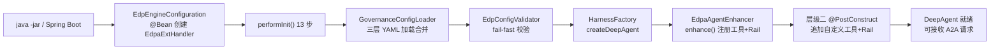

# FEAT_EDPAgent 开发方式特性用例_测试设计

> **版本**：v1.0
> **来源**：基于 `FEAT/FEAT_EDPAgent 开发方式特性用例文档.md` v1.1
> **代码基准**：`agent-solution/common/agent/edp-agent-java` + `edp-agent-config-driven-sample` + `edp-agent-integration-example`（feature-edpagent-dev，commit `de7ec82`）
> **日期**：2026-07-12

---

## 1. 背景与目标

### 背景

- 当前问题：EDPAgent v1.1 提供两个叠加层级的开发方式（层级一配置驱动、层级二深度定制），需验证两种方式的正确性和叠加兼容性
- 影响范围：所有基于 edp-agent-java 引擎的 Agent 创建、场景切换、深度定制和条件注册
- 需求来源：`FEAT/EDAgent简化重构方案_简化版.md` §六 开发方式

### 目标

- 目标 1：验证层级一（零代码）通过 YAML 配置 + `java -jar` 可创建可运行 Agent
- 目标 2：验证层级二（深度定制）通过 `@Configuration` + `@PostConstruct` 可追加自定义工具和 Rail
- 目标 3：验证场景级配置继承覆盖规则（9 条）全部按预期生效
- 目标 4：验证配置校验 fail-fast 机制正确拦截缺失配置
- 目标 5：验证条件注册（沙箱 Rail、TodoRail）按配置开关生效

### 非目标

- 非目标 1：不测试 agent-runtime HTTP 入口层
- 非目标 2：不测试 DeepAgent 内部 ReAct 循环逻辑
- 非目标 3：不测试 OpenJiuwen SDK 内部实现

---

## 2. 场景、规则与约束

### 核心场景

| 场景 | 触发条件 | 预期结果 |
|------|---------|---------|
| 层级一配置驱动创建 Agent | 编写 governance/*.yaml + application.yml，`java -jar` 启动 | Agent 就绪，含 4 工具 + 10 Rail，可接收 A2A 请求 |
| 场景级增量覆盖 | 场景目录下创建 governance/*.yaml 并配置增量字段 | 框架级 + 场景级按继承规则合并生效 |
| 切换业务场景 | 修改 `edpa.agent.scenario-home` 指向新场景目录 | Agent 按新场景规则运行，框架级配置不变 |
| 层级二自定义工具 | 创建 `@Configuration` 类，`@PostConstruct` 中 `registerHarnessTool()` | 自定义工具注册到 DeepAgent，LLM 可调用 |
| 层级二自定义 Rail | 创建 `@Configuration` 类，`@PostConstruct` 中 `registerRail()` | 自定义 Rail 按优先级参与 ReAct 循环 |
| 层级一+层级二叠加 | 同时配置 YAML + 自定义 `@Configuration` | 两层工具和 Rail 共存，互不干扰 |
| 配置校验 fail-fast | model/versatile/scenarioHome 缺失 | 应用启动失败，抛出 IllegalArgumentException |
| 条件注册（沙箱） | `sandbox.enabled=true` | SandboxInterruptRail 注册；`false` 则不注册 |

### 关键规则

| 规则 | 说明 |
|------|------|
| 层级二不继承 EdpaExtHandler | 使用 `@Configuration` + `@PostConstruct` + 构造器注入 + `instanceof` 强转模式 |
| allowed_tools 仅约束层级一 | 层级二通过 `registerHarnessTool()` 直接注册的工具不受 allowed_tools 过滤 |
| scope.allowed 替代式覆盖 | 场景级完全替代框架级值 |
| scope.denied 追加拼接 | 取并集，场景不能移除框架禁止项 |
| base_protocol 不可覆盖 | 框架内置协议，场景级无法修改 |
| additional_prompt 有序拼接 | 框架 + 场景顺序拼接 |
| max_subtasks/max_steps 取 min | 场景不能放宽框架上限 |
| allowed_tools 叠加合并去重 | 框架 + 场景合并保持顺序 |
| tool_limits 同 key 取 min | 同 key 取最小值 |
| general_scripts 逐字段继承式覆盖 | 场景级覆盖同名字段 |
| think_chunk_scripts 继承式覆盖 | 资源限制字段取 min |
| EdpaTodoRail 条件注册 | 仅当 todolist 条目非空时创建 EdpaTodolist 对象 → Rail 注册 |
| SandboxInterruptRail 条件注册 | 仅当 sandbox.enabled=true 时注册 |

### 关键约束

| 约束 | 说明 | 影响 |
|------|------|------|
| Java 版本 | Java 17+（Spring Boot 3.x + Jakarta EE） | 低版本无法编译 |
| Redis 依赖 | RedisTodoStore + RedisCheckpointer 必须 | 无 Redis 时启动失败 |
| Model 配置必填 | model.provider/name/baseUrl/apiKey 缺一不可 | fail-fast |
| Versatile 配置必填 | versatile.url 为空时 fail-fast | call_versatile 工具不可用 |
| scenarioHome 路径必填 | 路径不存在时 fail-fast | 无 governance 配置加载 |
| sandbox.service-url 未校验 | enabled=true 但 service-url 为空时无 fail-fast | 运行时沙箱调用可能失败 |
| performInit 为静态方法 | 无法通过子类覆写扩展 | 层级二必须用 Spring 生命周期模式 |

### 待确认点

| 问题 | 影响 | 当前处理 |
|------|------|---------|
| sandbox.service-url 非空校验 | 沙箱模式运行时可能调用失败 | 待跟踪，建议新增 validateSandboxConfig() |
| §1.3 系统边界表 DeepAgent 注释 | 文档边界描述轻微矛盾 | 待跟踪，建议增加接口调用注释 |

---

## 3. 总体方案

### 方案概述

1. 入口：`java -jar` 启动引擎 JAR（层级一）或 Spring Boot `@SpringBootApplication`（层级二）
2. 核心处理：`EdpaExtHandler.performInit()` 静态方法执行 13 步初始化 → `EdpaAgentEnhancer.enhance()` 注册 4 工具 + 10 Rail
3. 数据读写：governance/*.yaml 三层加载 → `GovernanceConfigLoader` 合并 → `SysScriptsConfig` 话术加载
4. 对下游生效：DeepAgent 就绪后通过 `streamQuery()` 接收 A2A 请求

### 链路图 / 流程图

### 模块分工

| 模块 | 职责 | 输入 | 输出 |
|------|------|------|------|
| `EdpEngineConfiguration` | Spring Bean 工厂，创建 EdpaExtHandler | `EdpaSpringBootConfig` + agentName | `AgentHandler` Bean |
| `EdpaExtHandler.performInit()` | 13 步静态初始化 | config + redisTodoStore + agentName | `InitResult` |
| `GovernanceConfigLoader` | 三层 YAML 加载 + 场景级合并 | scenarioHome 路径 | `GovernanceConfig` |
| `EdpConfigValidator` | 配置校验 fail-fast | model/versatile/scenarioHome | 通过或抛异常 |
| `EdpaAgentEnhancer` | 注册 4 工具 + 10 Rail | deepAgent + 13 参数 | 增强后的 DeepAgent |
| `CustomerAgentConfig`（层级二） | 追加自定义工具和 Rail | `AgentHandler` Bean | 注册到 DeepAgent |

---

## 4. 关键设计

| 设计点 | 处理方式 | 异常/边界 |
|--------|---------|----------|
| 层级一 Bean 创建 | `performInit()` 静态方法 → `new EdpaExtHandler(Object)` → `applyInitResult()` | performInit 内部 fail-fast |
| 层级二扩展模式 | `@Configuration` + 构造器注入 `AgentHandler` + `@PostConstruct` + `instanceof` 强转 | AgentHandler 非 EdpaExtHandler 时跳过 |
| 场景级合并 | `GovernanceConfig.mergeScenarioConfig()` 按字段级继承规则 | base_protocol 不可覆盖 |
| 工具注册过滤 | `EdpaBusinessTools.build()` 遍历 allowed_tools | 层级二工具不受此过滤 |
| Rail 条件注册 | `buildBusinessRails()` 检查 sandbox.enabled / edpaTodolist!=null | 条件不满足时跳过注册 |
| Rail 优先级 | `priority()` 决定执行顺序 | 同优先级按注册顺序执行 |

### 接口说明

| 接口/调用 | 类型 | 调用方 | 入参要点 | 字段约束/默认值 | 出参/事件 | 错误或异常 |
|-----------|------|--------|---------|----------------|----------|-----------|
| `EdpaExtHandler.performInit()` | SDK 静态方法 | EdpEngineConfiguration | config, redisTodoStore, agentName | agentName 默认 "EDPAgent" | InitResult | model/versatile/scenario 缺失时 IllegalArgumentException |
| `EdpaAgentEnhancer.enhance()` | SDK 静态方法 | performInit 第 12 步 | deepAgent 等 13 参数 | — | 增强后的 DeepAgent | — |
| `deepAgent.registerHarnessTool()` | SDK 方法 | 层级二 @PostConstruct | Tool 对象 | — | 工具注册到 DeepAgent | — |
| `deepAgent.getAgent().registerRail()` | SDK 方法 | 层级二 @PostConstruct | AgentRail 对象 | — | Rail 注册到拦截链 | — |
| A2A streamQuery | HTTP SSE | agent-runtime | query, sessionId | — | SSE 事件流 | — |

### 配置说明

| 配置项 | 所在位置 | 默认值 | 生效时机 | 影响范围 | 回滚/关闭方式 |
|--------|---------|--------|---------|---------|-------------|
| `edpa.agent.scenario-home` | application.yml | — | 启动时 | 场景目录加载 | 修改路径重启 |
| `edpa.agent.model.*` | application.yml | — | 启动时 | LLM 连接 | 环境变量覆盖 |
| `edpa.agent.redis.*` | application.yml | localhost:6379 | 启动时 | Redis 连接 | 环境变量覆盖 |
| `edpa.agent.versatile.url` | application.yml | — | 启动时 | call_versatile 工具 | 环境变量覆盖 |
| `edpa.agent.sandbox.enabled` | application.yml | false | 启动时 | SandboxInterruptRail 注册 | 设为 false |
| `edpa.agent.sandbox.service-url` | application.yml | — | 启动时 | 沙箱调用地址 | — |
| governance/*.yaml | scenarios/{场景}/governance/ | 框架级 | 启动时 | 角色定位/行为治理/话术 | 修改文件重启 |

---

## 5. 可观测性

### 观测点

| 观测点 | 日志/指标/状态 | 用途 |
|--------|--------------|------|
| Spring Boot 启动日志 | `EdpEngineConfiguration: edpaExtHandler bean created` | 确认 Bean 创建成功 |
| performInit 日志 | `performInit` 各步骤 LOGGER.info | 确认 13 步初始化完整执行 |
| 工具注册日志 | `Registered business tool: {toolName}` | 确认层级一 4 个工具注册 |
| Rail 注册日志 | `Registered rail: {railClass}` | 确认层级一 10 个 Rail 注册 |
| 层级二注册日志 | `[LAYER2] Custom tool registered: {toolId}` | 确认自定义工具注册 |
| 层级二注册日志 | `[LAYER2] Custom rail registered: {railClass}` | 确认自定义 Rail 注册 |
| 配置校验异常 | `IllegalArgumentException: {配置项} 未配置` | fail-fast 失败定位 |
| allowed_tools 为空 | `No allowed_tools configured, registering no business tools` | 确认无业务工具注册 |
| .todo 持久化 | `scenarios/{场景}/.todo/conv-*/todo.json` | 确认 Agent 实际运行 |
| LLM 调用日志 | `LOGGER.info` in EdpaEventRail | 确认 ReAct 循环事件序列 |
| 沙箱跳过日志 | `sandbox.enabled=false, skipping SandboxInterruptRail` | 确认条件注册生效 |

---

## 6. 测试建议

### 建议测试重点与开发自测门禁

| 前置/触发条件 | 建议测试重点 | 希望保证的结果 | 优先级建议 | 建议测试方式 | 是否开发自测门禁 |
|--------------|------------|--------------|-----------|------------|----------------|
| 编写 governance/*.yaml + application.yml，`java -jar` 启动 | 层级一配置驱动创建 Agent | Agent 就绪，含 4 工具 + 10 Rail，启动日志无异常 | P0 | 端到端 | 是 |
| 层级一启动后发送 A2A 请求 | Agent 可接收请求并返回 SSE 事件 | streamQuery 返回 SSE 事件流，.todo 持久化文件生成 | P0 | 端到端 | 是 |
| 场景级配置 scope.allowed/denied | 场景级增量覆盖 | scope.allowed 替代，scope.denied 并集 | P0 | 集成 | 是 |
| 场景级配置 base_protocol | 不可覆盖规则 | 场景级 base_protocol 被忽略，框架值保留 | P0 | 单测 | 是 |
| 场景级配置 max_steps > 框架级 | 取 min 规则 | 实际 max_steps = min(框架, 场景) | P0 | 单测 | 是 |
| 修改 scenario-home 指向新场景 | 切换业务场景 | Agent 按新场景规则运行，框架级不变 | P0 | 端到端 | 否 |
| 创建 @Configuration + @PostConstruct + registerHarnessTool | 层级二自定义工具注册 | 自定义工具注册成功，LLM 可调用 | P0 | 集成 | 是 |
| 创建 @Configuration + @PostConstruct + registerRail | 层级二自定义 Rail 注册 | 自定义 Rail 注册成功，priority 生效 | P0 | 集成 | 是 |
| 层级一+层级二叠加使用 | 两层共存 | DeepAgent 含 4+10 框架 + N+M 自定义 | P0 | 集成 | 是 |
| model.name 为空 | 配置校验 fail-fast | 启动失败，IllegalArgumentException | P0 | 单测 | 是 |
| versatile.url 为空 | 配置校验 fail-fast | 启动失败，IllegalArgumentException | P0 | 单测 | 是 |
| scenarioHome 路径不存在 | 配置校验 fail-fast | 启动失败，IllegalArgumentException | P0 | 单测 | 是 |
| sandbox.enabled=true | 沙箱条件注册 | SandboxInterruptRail 注册 | P1 | 集成 | 否 |
| sandbox.enabled=false（默认） | 沙箱条件注册 | SandboxInterruptRail 不注册 | P1 | 集成 | 否 |
| actrule.todolist 为空 | TodoRail 条件注册 | EdpaTodoRail 不注册 | P1 | 集成 | 否 |
| actrule.todolist 非空 | TodoRail 条件注册 | EdpaTodoRail 注册 | P1 | 集成 | 否 |
| 层级二 allowed_tools 不含自定义工具名 | allowed_tools 约束边界 | 层级二工具仍可被 LLM 调用（不受约束） | P1 | 集成 | 否 |
| 场景级 tool_limits 同 key | 取 min 规则 | 实际限制 = min(框架, 场景) | P1 | 单测 | 否 |
| 场景级 additional_prompt | 有序拼接 | 框架 + 场景顺序拼接 | P1 | 单测 | 否 |
| 场景级 general_scripts | 逐字段继承覆盖 | 场景级覆盖同名字段 | P2 | 单测 | 否 |
| 场景级 think_chunk_scripts | 继承式覆盖 | 资源限制字段取 min | P2 | 单测 | 否 |
| AgentHandler 非 EdpaExtHandler | instanceof 守卫 | 跳过注册，输出 warn 日志，不阻断 | P2 | 单测 | 否 |
| DeepAgent 为 null | getDeepAgent() null 检查 | 跳过注册，输出 warn 日志 | P2 | 单测 | 否 |
| @PostConstruct 未做 instanceof 守卫 | 类型安全异常 | ClassCastException，启动失败 | P2 | 单测 | 否 |
| allowed_tools 为空列表 | 无业务工具注册 | 注册 0 个业务工具，输出 info 日志 | P2 | 单测 | 否 |
| sandbox.enabled=true 但 service-url 为空 | 沙箱配置缺失 | 沙箱 Rail 注册但运行时调用失败（未实现 fail-fast） | P2 | 集成 | 否 |

### 关键异常与边界

- 层级一零代码启动时 governance/*.yaml 全部缺失 → 应 fail-fast 或使用框架级默认
- 场景级配置尝试放宽框架 max_steps 上限 → 应被取 min 截断
- 场景级配置尝试修改 base_protocol → 应被忽略
- 层级二 `@PostConstruct` 中 AgentHandler 类型不符 → 应安全跳过，不抛异常
- 层级二 `@PostConstruct` 中 DeepAgent 为 null → 应安全跳过
- 层级二未做 instanceof 守卫直接强转 → 应抛出 ClassCastException
- allowed_tools 为空 → 不注册任何业务工具，不影响框架原生工具
- sandbox.enabled=true 但 service-url 为空 → 无 fail-fast（已知 TODO）
- 同优先级 Rail 冲突 → 按注册顺序执行，不报错

---

## 附录：补充文档

| 文档 | 用途 | 链接/路径 |
|------|------|---------|
| 特性用例文档 | 8 个用例详细定义 | `FEAT/FEAT_EDPAgent 开发方式特性用例文档.md` |
| 简化重构方案 | 方案设计和开发方式说明 | `FEAT/EDAgent简化重构方案_简化版.md` |
| 层级一示例项目 | 零代码配置驱动示例 | `agent-solution/common/example/edp-agent-config-driven-sample` |
| 层级二示例项目 | 深度定制（Java 代码）示例 | `agent-solution/common/example/edp-agent-integration-example` |
| 评审报告 | 特性用例评审意见（附录 B） | `FEAT/FEAT_EDPAgent 开发方式特性用例文档.md#附录B` |
