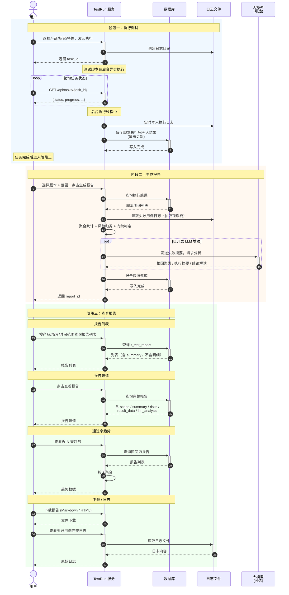

# 测试报告 — 时序图

```mermaid
sequenceDiagram
    autonumber

    actor User as 用户
    participant API as TestRun 服务
    participant DB as 数据库
    participant FS as 日志文件
    participant LLM as 大模型<br/>(可选)

    %% ============================================================
    %% 阶段一：执行测试
    %% ============================================================
    rect rgb(240, 248, 255)
        Note over User, FS: 阶段一：执行测试

        User->>+API: 选择产品/场景/特性，发起执行
        API->>FS: 创建日志目录
        API-->>-User: 返回 task_id

        Note over API: 测试脚本在后台异步执行

        loop 轮询任务状态
            User->>+API: GET /api/tasks/{task_id}
            API-->>-User: {status, progress, ...}
        end

        Note over API: 后台执行过程中
        API->>FS: 实时写入执行日志
        API->>+DB: 每个脚本执行完写入结果<br/>(覆盖更新)
        DB-->>-API: 写入完成

        Note over User: 任务完成后进入阶段二
    end

    %% ============================================================
    %% 阶段二：生成报告
    %% ============================================================
    rect rgb(255, 248, 240)
        Note over User, LLM: 阶段二：生成报告

        User->>+API: 选择版本 + 范围，点击生成报告
        API->>+DB: 查询执行结果
        DB-->>-API: 脚本明细列表
        API->>FS: 读取失败用例日志（抽取错误栈）
        API->>API: 聚合统计 + 风险归类 + 门禁判定

        opt 已开启 LLM 增强
            API->>+LLM: 发送失败摘要，请求分析
            LLM-->>-API: 根因聚类 / 执行摘要 / 结论解读
        end

        API->>+DB: 报告快照落库
        DB-->>-API: 写入完成
        API-->>-User: 返回 report_id
    end

    %% ============================================================
    %% 阶段三：查看报告
    %% ============================================================
    rect rgb(240, 255, 240)
        Note over User, DB: 阶段三：查看报告

        Note over User,DB: 报告列表
        User->>+API: 按产品/场景/时间范围查询报告列表
        API->>+DB: 查询 t_test_report
        DB-->>-API: 列表（含 summary，不含明细）
        API-->>-User: 报告列表

        Note over User,DB: 报告详情
        User->>+API: 点击查看报告
        API->>+DB: 查询完整报告
        DB-->>-API: 含 scope / summary / risks /<br/>result_data / llm_analysis
        API-->>-User: 报告详情

        Note over User,DB: 通过率趋势
        User->>+API: 查看近 N 天趋势
        API->>+DB: 查询区间内报告
        DB-->>-API: 报告列表
        API->>API: 按天聚合
        API-->>-User: 趋势数据

        Note over User,DB: 下载 / 日志
        User->>+API: 下载报告 (Markdown / HTML)
        API-->>-User: 文件下载

        User->>+API: 查看失败用例完整日志
        API->>+FS: 读取日志文件
        FS-->>-API: 日志内容
        API-->>-User: 原始日志
    end
```
