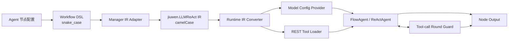
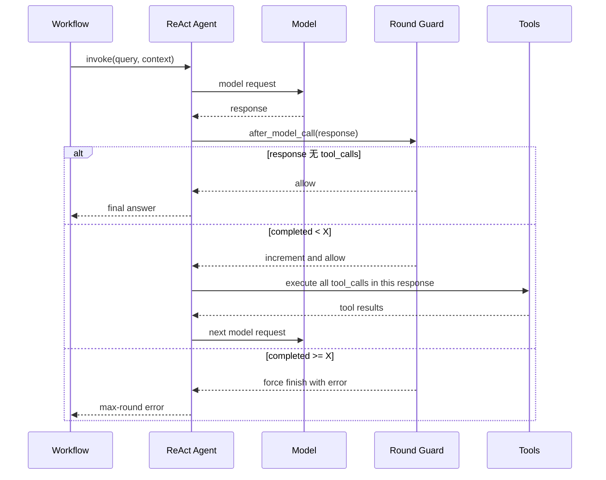

# 反应代理节点（LLMReAct）FE 设计文档

**文档类型：** Feature Design  
**日期：** 2026-08-13  
**状态：** 待评审  
**范围：** Studio Frontend、Manager、OpenJiuwen Runtime

## 1. 文档目的

本文定义工作流“反应代理（ReAct Agent）”节点的产品语义和端到端技术方案，是开发、联调、测试和验收的设计依据。

本文描述“系统应该如何工作”，不记录具体提交、开发过程或实现结果。除非后续 FE 评审形成新结论，Frontend、Manager 和 Runtime 均应遵循本文定义的字段契约与执行语义。

## 2. 背景与问题

反应代理节点允许大模型根据用户输入自主判断是否调用工具，并根据工具结果继续推理或生成最终答案。节点需要跨越三个系统：

- Frontend：完成节点编排与配置；
- Manager：保存工作流 DSL，并转换为发布 IR；
- Runtime：将 IR 转为可执行 ReAct Agent，管理模型、工具和终止条件。

现有设计存在以下问题：

1. “最大迭代轮次”没有统一语义，可能被理解为模型请求次数、模型与用户的对话次数或工具调用次数；
2
3. “插件执行成功”和“识别用户退出意图”两个终止条件依赖模型或插件的非确定性判断，难以形成稳定、可测试的执行边界；
4. Studio 的 `Agent` DSL 与 Runtime 的 ReAct 执行组件之间缺少明确、稳定的 IR 契约；
5. REST 插件必须以合法 JSON Schema 注册给模型，否则模型服务可能拒绝请求。

## 3. 设计目标

### 3.1 功能目标

- 提供可配置模型、输入参数、插件、提示词和终止条件的 ReAct Agent 节点；
- 统一“最大迭代轮次”为“最大工具调用轮次”；
- 同一模型响应内并行调用任意多个工具，只计为一轮；
- 达到工具调用上限后，仍允许模型根据最后一轮工具结果生成最终回答；
- 如果模型继续发起超出上限的工具调用，在工具执行前终止节点；
- Frontend DSL、Manager IR 和 Runtime 配置形成明确的一对一映射；
- REST 插件参数以标准 JSON Schema 提供给模型；
- 兼容历史 Agent 草稿，不因废弃字段导致打开或保存失败。

### 3.2 质量目标

- 计数状态按单次工作流调用隔离，不跨会话或循环迭代泄漏；
- 超限行为确定、可观测、可自动化测试；
- 模型不可生成或覆盖插件鉴权信息、固定请求头和隐藏参数；
- 单个节点的模型和工具资源不能污染其他 Agent 节点；
- 新设计不改变工作流整体的流式协议、Trace 协议和下游连线方式。

## 4. 非目标

- 不设计新的 ReAct 推理算法；
- 不限制一轮内并行工具调用的数量；
- 不支持按某个插件执行成功自动终止；
- 不支持通过模型识别用户退出意图自动终止；
- 不改造插件服务本身的请求、鉴权和响应协议；
- 不统一 Controller、ParamExtraction 等其他节点的迭代参数；
- 不在本 FE 中新增 Agent 人工确认、暂停或恢复能力；
- 不承诺所有模型都能严格按照提示词进行多轮工具调用。

## 5. 用户场景

### 5.1 直接回答

用户问题不需要工具。模型直接输出答案，节点不产生工具调用轮次并正常结束。

### 5.2 单轮工具调用

模型调用一个天气插件，获得结果后输出答案。工具调用计为一轮。

### 5.3 单轮并行工具调用

用户要求对比南京和上海天气。模型在一次响应中并行调用两个天气工具。两个工具合计只计为一轮。

### 5.4 多轮条件调用

模型必须根据上一轮工具结果决定下一轮调用对象。每个包含工具调用的模型响应计为一轮，直到模型输出最终答案或触发上限。

### 5.5 超过上限

配置上限为 `X`。模型已经完成 `X` 轮工具调用，下一次响应仍要求调用工具。Runtime 在执行该工具前终止节点，并返回确定的错误结果。

### 5.6 历史草稿升级

旧 Agent 节点包含已经下线的终止条件。用户可以正常打开草稿；界面不再展示旧条件；再次保存时只保留新契约支持的字段。

## 6. 需求定义

| 编号 | 需求 |
| --- | --- |
| FR-01 | Agent 节点必须支持配置模型、输入、REST 插件、系统提示词和最大工具调用轮次。 |
| FR-02 | 新建节点的最大工具调用轮次默认值为 9。 |
| FR-03 | 产品界面允许配置 1–20 的整数。 |
| FR-04 | 只有包含至少一个 `tool_call` 的模型响应才计入轮次。 |
| FR-05 | 同一模型响应中的多个并行 `tool_call` 只计一轮。 |
| FR-06 | 前 X 轮工具调用允许执行，第 X 轮完成后允许模型生成最终回答。 |
| FR-07 | 第 X 轮完成后若模型再次请求工具，Runtime 必须在工具执行前终止。 |
| FR-08 | 超限结果必须标记为错误，而不是正常回答。 |
| FR-09 | 新 DSL 和 IR 不得包含插件成功退出、用户意图退出相关字段。 |
| FR-10 | 历史草稿中的废弃字段必须在下一次保存时被清理。 |
| FR-11 | REST 工具参数必须以顶层 `type: object` 的 JSON Schema 注册给模型。 |
| FR-12 | 请求头、鉴权和隐藏参数不得暴露给模型填写。 |

## 7. 核心概念

### 7.1 模型调用

Agent 向模型发起的一次请求。模型响应分为两类：

- 最终回答：响应中没有 `tool_calls`；
- 工具请求：响应中包含一个或多个 `tool_calls`。

### 7.2 工具调用轮次

一次“工具请求”模型响应构成一个工具调用轮次。计数对象是模型响应，不是响应中的工具数量。

```text
response(tool A)                    -> 1 轮
response(tool A, tool B, tool C)    -> 1 轮
response(final text)                -> 0 轮
```

### 7.3 最大工具调用轮次

配置 `X` 表示最多允许执行 `X` 个工具调用轮次。它不是：

- 用户与模型的对话轮数；
- 模型请求总数；
- 单个工具的调用次数；
- 一轮内工具调用数量。

## 8. 方案选型

### 8.1 候选方案

#### 方案 A：使用 ReAct 内部总迭代次数

直接把 `max_iteration` 传给 ReAct Agent，由 Agent 根据模型循环次数退出。

缺点：

- 最终回答本身也可能占用一次迭代；
- 无法稳定表达“允许 X 轮工具后再回答”；
- 不同 ReAct 实现对 iteration 的定义可能不同；
- 超限时难以保证在工具执行前拦截。

#### 方案 B：按单个工具调用计数

每执行一个工具计数一次。

缺点：

- 一轮并行调用多个工具会快速消耗额度；
- 相同推理结构会因模型是否选择并行调用而产生不同上限行为；
- 与产品希望限制“ReAct 推理深度”的目标不一致。

#### 方案 C：在模型响应后按工具调用轮次计数

在模型响应生成后、工具执行前检查 `tool_calls`。一次响应只增加一次计数。

优点：

- 精确表达产品语义；
- 天然支持并行工具；
- 可以在超限工具执行前终止；
- 与模型最终回答解耦；
- 易于按请求保存状态并进行单元测试。

### 8.2 设计决策

选择方案 C。

Runtime 使用模型调用后的拦截扩展统计工具调用轮次。ReAct 内部总迭代上限仅作为安全兜底，不作为产品终止条件的权威实现。

## 9. 总体架构



### 9.1 分层职责

| 层级 | 职责 | 不承担的职责 |
| --- | --- | --- |
| Frontend | 配置交互、输入约束、DSL 保存、旧字段清理 | 不解释 Runtime 工具执行状态 |
| Manager | DSL 校验、字段转换、插件配置补全、IR 生成 | 不执行 ReAct，不统计轮次 |
| Runtime Converter | 解析 IR，构造模型、工具和 Agent | 不修改持久化 DSL/IR |
| ReAct Agent | 调用模型、执行工具、维护推理上下文 | 不自行定义产品轮次语义 |
| Round Guard | 识别工具请求、按响应计数、超限终止 | 不解析业务工具结果 |

## 10. 前端交互设计

### 10.1 面板结构

Agent 节点配置面板按以下顺序展示：

1. 模型配置；
2. 输入参数；
3. 插件；
4. 工具使用约束；
5. 终止条件；
6. 输出参数。

### 10.2 终止条件区域

- 区域默认展开；
- 只展示“最大迭代轮次”；
- 标题保留现有产品命名，说明文字明确其实际含义是工具调用轮次；
- 同时提供滑块与数字输入框；
- 两个控件绑定同一个值；
- 最小值 1，最大值 20，精度为 0；
- 滑块结束拖动或数字值变化后触发保存；
- 单位显示“次”。

建议中文文案：

> ReAct 工具调用超过设置的最大轮次后终止该节点；同一轮并行调用多个工具只计为一轮。

建议英文文案：

> The node stops before a ReAct tool-call round exceeds this limit. Parallel tool calls in one model response count as one round.

### 10.3 删除的交互

终止条件区域不再展示：

- “插件执行成功”开关；
- 跳出插件多选框；
- “识别到用户有退出意图”开关；
- 上述能力的说明文案、启停状态和校验提示。

### 10.4 输出展示

Agent 节点继续对下游暴露只读的 `output: string`。前端节点配置不新增 `result_type` 输出端口，错误类型由 Runtime 执行协议和 Trace 使用。

## 11. 数据模型设计

### 11.1 Frontend DSL

```ts
interface AgentConfig {
  model: LLMConfig;
  system_prompt: string;
  max_iteration: number;
  temperature: number;
  top_p: number;
  max_tokens: number | null;
  plugins: AgentPluginRef[];
}
```

新建节点的建议默认值：

```json
{
  "system_prompt": "",
  "max_iteration": 9,
  "temperature": 0.5,
  "top_p": 0.5,
  "max_tokens": null,
  "model": {
    "model_name": "",
    "model_type": "",
    "model_deployment_id": "",
    "model_id": ""
  },
  "plugins": []
}
```

### 11.2 废弃字段

以下字段不属于新设计：

```text
break_plugin_ids
enable_intent_break
```

约束：

- 新建节点不得生成；
- 类型定义不得声明；
- 保存旧节点时必须删除；
- Manager 不得校验或转换；
- Runtime 不得读取并影响执行。

### 11.3 Manager IR

发布 IR 使用 `jiuwen.LLMReAct`：

```json
{
  "id": "message-node",
  "name": "Agent",
  "type": "jiuwen.LLMReAct",
  "configs": {
    "systemPrompt": "{{query}}",
    "maxIteration": 5,
    "model": {},
    "plugins": []
  },
  "inputs": {
    "userFields": {
      "query": "${start.systemFields.query}"
    }
  },
  "outputs": {
    "userFields": {
      "output": ""
    }
  }
}
```

### 11.4 字段映射

| DSL | IR | Runtime | 必填 | 缺省 |
| --- | --- | --- | --- | --- |
| `type: Agent` | `type: jiuwen.LLMReAct` | LLMReAct converter | 是 | 无 |
| `system_prompt` | `systemPrompt` | `system_prompt` | 否 | `""` |
| `max_iteration` | `maxIteration` | `max_iteration` | 是 | 产品默认 9 |
| `model` | `model` | SDK Model | 是 | 无 |
| `plugins` | `plugins` | `List[Tool]` | 否 | `[]` |

设计要求：正常 Studio 发布链路必须显式写入 `maxIteration`，不得依赖不同层的隐式默认值。

## 12. Manager 设计

### 12.1 DSL 校验

Manager 对 Agent 节点执行以下校验：

- 模型配置可用；
- 插件引用包含合法标识；
- 绑定插件在当前项目中存在且用户有权访问；
- `max_iteration` 为整数并位于产品允许范围；
- 输入引用满足工作流通用引用规则。

Manager 不再校验跳出插件列表，因为该字段已经废弃。

### 12.2 IR 适配

Manager 负责：

1. 将 Agent 节点类型映射为 `jiuwen.LLMReAct`；
2. 将 snake_case 配置键映射为 camelCase；
3. 把前端模型引用转换为 Runtime 可解析的模型 IR；
4. 根据插件引用补全插件 URL、方法、鉴权、输入参数、输出参数和版本信息；
5. 只输出新契约定义的终止条件字段。

如果输入 DSL 仍包含废弃字段，Manager 应忽略而不是发布到新 IR。

## 13. Runtime 节点构建设计

### 13.1 IR 识别

Runtime IR Converter 必须为 `jiuwen.LLMReAct` 注册独立转换分支。转换结果是可加入工作流图的 Agent 组件，并保持原节点 ID、节点类型和输入输出映射。

### 13.2 模型解析

模型构造复用 Runtime 的模型配置 Provider：

1. 从 `configs.model` 提取模型配置；
2. 通过 Provider 解析模型服务地址、鉴权和请求参数；
3. 构造 SDK Model；
4. 将 SDK Model 注入 Agent。

`systemPrompt`、`plugins` 和 `maxIteration` 不进入模型 Provider，避免模型配置与 Agent 策略配置耦合。

### 13.3 插件加载

对每个 `plugins[]` 元素：

1. 转换为 REST ToolCard 和 Tool 实例；
2. 使用 Agent 节点 ID 作为资源 tag；
3. 将 ToolCard 注册到 Agent 能力管理器；
4. 将 Tool 实例注册到 Runtime 资源管理器。

资源 tag 必须保证两个 Agent 节点绑定同名工具时仍可隔离。

插件加载失败策略：

- 工作流发布校验阶段应尽可能提前发现无效插件；
- Runtime 构造阶段记录包含节点 ID 和插件名的错误；
- 是否允许跳过单个失败插件继续执行，应由实现阶段在“严格失败”和“降级继续”中选择，并在 FE 评审时确认。

### 13.4 延迟初始化

Agent 可在首次执行时完成模型注入、工具注册和轮次 Guard 注册。初始化必须具备幂等性，避免同一组件重复注册工具或 Guard。

## 14. 工具调用轮次控制设计

### 14.1 拦截时机

Guard 位于：

```text
模型响应完成 -> Guard 检查 -> 工具执行
```

不能放在工具执行后，否则超限工具已经产生外部副作用；也不能仅依赖循环结束后检查，否则无法区分最终回答和下一轮工具请求。

### 14.2 状态模型

```text
tool_call_rounds: integer >= 0
max_tool_call_rounds: integer >= 1
```

计数状态必须存放在单次 Agent 调用上下文中，不能存放在组件实例、全局变量或共享 Tool 实例中。

### 14.3 判定算法

```text
after_model_call(response, context):
    if response.tool_calls is empty:
        allow response
        return

    completed = context.tool_call_rounds or 0

    if completed >= max_tool_call_rounds:
        force_finish(ERROR_MAX_TOOL_CALL_ROUNDS)
        return

    context.tool_call_rounds = completed + 1
    allow tools to execute
```

### 14.4 ReAct 总迭代保护

产品上限是工具调用轮次，而 ReAct 内部通常还需要在最后一轮工具执行后再请求一次模型生成答案。因此内部总迭代安全值至少应允许：

```text
X 轮工具调用 + 1 次最终回答
```

内部迭代限制只是防御性保护，不能取代 Guard 的产品语义。

### 14.5 时序



## 15. REST 工具 Schema 设计

### 15.1 Schema 契约

提供给模型的工具参数必须满足：

```json
{
  "type": "object",
  "properties": {}
}
```

即使插件没有模型可填写的参数，也必须保持顶层 object 结构，不能使用空对象 `{}` 作为完整 schema。

### 15.2 参数映射

| 插件参数 | JSON Schema |
| --- | --- |
| 标量 | 对应 `string`、`integer`、`number`、`boolean` 类型 |
| object | 递归生成 `type: object` 与 `properties` |
| array<T> | 生成 `type: array` 与 `items` |
| array<object> | 递归生成 `items.properties` |
| required | 写入当前对象的 `required` 数组 |
| description | 写入属性 `description` |
| default | 非空时写入属性 `default` |

### 15.3 参数可见性

允许模型填写：

- Query 参数；
- Body 参数；
- Path 参数；
- 其他明确标记为可见的业务参数。

禁止暴露：

- Header 参数；
- 鉴权参数；
- `visible = false` 的隐藏参数；
- 平台固定注入的请求配置。

## 16. 输出与错误契约

### 16.1 正常输出

```json
{
  "userFields": {
    "output": "模型最终回答",
    "result_type": "answer"
  }
}
```

### 16.2 超限输出

```json
{
  "userFields": {
    "output": "Max iterations reached without completion",
    "result_type": "error"
  }
}
```

设计约束：

- 超限是节点执行结果，不应升级为工作流构造异常；
- 超限工具不得执行；
- 下游节点仍可获得确定的 `output`；
- Trace 必须保留 `result_type = error`；
- 错误文本可在后续国际化设计中替换为错误码映射，但结果类型不可丢失。

## 17. 兼容性设计

### 17.1 历史 DSL

Frontend 读取旧 Agent 配置时允许存在未知废弃字段。保存时基于新结构重建配置，明确删除：

```text
break_plugin_ids
enable_intent_break
```

### 17.2 历史 IR

Runtime 遇到旧 IR 中的 `breakPluginIds` 或 `enableIntentBreak` 时忽略这些字段。终止行为只由 `maxIteration` 控制。

### 17.3 默认值

规范默认值为 9。正常 Studio 发布路径必须显式传递该值。Frontend、Manager 和 Runtime 可以保留防御性缺省，但不应依赖缺省差异表达业务逻辑。

### 17.4 破坏性影响

依赖以下行为的旧工作流会发生语义变化：

- 某插件成功后立即退出；
- 模型识别用户退出意图后立即退出。

产品升级说明必须明确告知用户：以上终止条件已删除，需使用工具调用轮次与提示词约束替代。

## 18. 安全设计

- 模型只能看到业务可填写的插件参数；
- 鉴权信息由平台安全通道注入，不能进入 Tool Schema；
- 隐藏参数不能出现在模型请求和 Trace 的工具定义中；
- 超限拦截必须发生在工具执行前，防止多余工具产生网络请求或业务副作用；
- 工具资源以节点维度隔离，避免跨节点误调用；
- 日志不得输出明文密钥、Token 或解密后的请求头。

## 19. 性能与容量

- Guard 每次模型响应只做常数级判断和一次整数读写；
- 并行工具只增加一次轮次计数，不引入额外串行等待；
- JSON Schema 在工具构造阶段生成，不在每轮推理中重复生成；
- 产品 UI 最大值为 20，用于限制长链路带来的模型成本、工具副作用和请求耗时；
- Runtime 必须保留更高但有限的防御上限，阻止异常 IR 造成无限循环。

## 20. 可观测性设计

### 20.1 日志

至少记录：

- Agent 节点 ID；
- 配置的最大工具调用轮次；
- 当前已完成轮次；
- 本次模型响应包含的工具数量；
- 超限终止事件；
- 插件加载失败及插件名称；
- 模型或工具执行异常。

日志不得记录鉴权密钥和敏感请求头。

### 20.2 Trace

Trace 应能够区分：

- Agent 节点开始与结束；
- 正常回答与错误结果；
- 超限导致的 `result_type = error`；
- 实际执行过的工具调用。

超限后未执行的工具不得出现在“工具执行成功”事件中。

## 21. 测试设计

### 21.1 Frontend

- 新建节点默认值为 9；
- 终止条件默认展开；
- 只展示最大迭代轮次；
- 滑块与输入框双向同步；
- 边界值 1、20 有效，0、21 和小数无效；
- 中英文提示正确；
- 历史草稿可打开；
- 保存历史草稿后废弃字段消失。

### 21.2 Manager

- Agent DSL 正确转换为 `jiuwen.LLMReAct`；
- snake_case 正确转换为 camelCase；
- `maxIteration` 被显式写入；
- 插件配置被完整补全；
- 废弃字段不进入 IR；
- 无效插件在发布校验阶段被发现；
- 非整数和越界轮次被拒绝。

### 21.3 Runtime 单元测试

- 无工具响应不计轮次；
- 单工具响应计一轮；
- 并行多个工具响应计一轮；
- 第 X 轮允许执行；
- 第 X+1 轮工具请求在执行前终止；
- 第 X 轮后最终回答可以返回；
- 两次独立调用的计数不串扰；
- 模型配置、提示词、插件和输出字段映射正确；
- REST 参数支持标量、对象、数组和对象数组；
- Header、鉴权和隐藏参数不进入 Schema；
- 无业务参数时仍生成合法 object Schema。

### 21.4 端到端测试

| 场景 | 预期 |
| --- | --- |
| 直接回答 | 0 轮工具调用，正常结束 |
| 查询单城市天气 | 1 轮工具调用，正常结束 |
| 同轮并行查询两个城市 | 只计 1 轮 |
| 依赖前一结果连续调用 X 轮 | X 轮均执行，允许最终回答 |
| 第 X+1 轮继续请求工具 | 工具不执行，返回 error |
| 连续执行同一工作流两次 | 两次均从 0 开始计数 |
| 旧草稿重新保存和发布 | IR 中无废弃字段 |
| 插件包含 Header 和隐藏参数 | 模型 Schema 中不可见 |

## 22. 发布与回滚设计

### 22.1 发布顺序

建议顺序：

1. Runtime 先支持新 `jiuwen.LLMReAct` 契约并忽略旧字段；
2. Manager 停止生成废弃字段；
3. Frontend 下线旧交互并在保存时清理字段；
4. 完成存量草稿和已发布 IR 的兼容性抽样验证；
5. 更新用户指南和升级说明。

该顺序保证新 Frontend 发布前，后端和 Runtime 已能处理新数据。

### 22.2 回滚

- 仅回滚 Frontend 时，旧 UI 可能重新依赖已不生效的字段，不建议单层回滚；
- Manager 与 Runtime 的契约必须配套回滚；
- 回滚不能恢复用户保存时已经删除的旧字段；
- 如需保留旧终止行为，应在升级前备份工作流版本，而不是依赖回滚自动重建字段。

## 23. 风险与待评审项

| 编号 | 风险/问题 | 建议 |
| --- | --- | --- |
| R-01 | UI 名称“最大迭代轮次”仍可能被误解 | 评审是否直接改名为“最大工具调用轮次” |
| R-02 | Frontend、Manager、Runtime 防御性默认值可能不一致 | 正常链路强制显式传值；后续统一共享常量 |
| R-03 | 单个插件加载失败后继续执行，模型可能缺少预期工具 | FE 评审确认严格失败或降级继续策略 |
| R-04 | 固定英文超限文本不适合直接面向用户 | 后续引入稳定错误码和国际化映射 |
| R-05 | 模型可能不遵守“禁止并行”类提示词 | 产品语义不得依赖提示词限制并行调用 |
| R-06 | 工具调用具有外部副作用 | Guard 必须在工具执行前拦截，并建议工具具备幂等能力 |

## 24. 验收标准

- Agent 节点能完成配置、保存、发布和 Runtime 执行；
- `max_iteration` 在端到端链路中只表示最大工具调用轮次；
- 同一次模型响应的并行工具调用只计一轮；
- 前 X 轮工具允许执行，第 X 轮后允许最终回答；
- 超限工具在执行前被阻止，并返回错误类型；
- 新 DSL 和 IR 不再包含两个废弃终止条件；
- 历史草稿能够打开并在保存后完成字段迁移；
- REST 工具使用合法的 object JSON Schema；
- Header、鉴权和隐藏参数不暴露给模型；
- 同一 Agent 组件跨会话、跨执行复用时计数不串扰；
- Frontend、Manager 和 Runtime 的自动化测试覆盖本文定义的边界场景。
