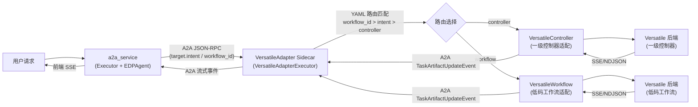

#  开发转测文档模版

> 目标：让评审人快速判断方案是否合理、边界是否清楚、约束是否明确、测试是否能覆盖。默认只保留基础必填内容，复杂功能和示例放到附录。

## 1. 背景与目标

本节用于对齐"为什么做"和"做到什么程度算完成"。只写和本次开发直接相关的背景，不展开无关历史。

### 背景

- 当前问题：agent-runtime 仅支持对接一个 Versatile 后端（一级控制器），所有协议适配逻辑（节点过滤、End 检测、报文解包）混杂在 `a2a_service/orchestrator/executor.py` 中，且 URL / Header / 路由策略与 a2a_service 紧耦合。
- 影响范围：VA 升级必须同步升级 Runtime，发布不灵活；业务字段（`node_type` / `event`）在 Runtime 层硬编码解析，后端协议任何变化都要改 a2a_service；无法支持一个 Runtime 同时调度多个工作流。
- 需求来源：VersatileAdapter Sidecar 多后端路由需求（PR #306 + PR #320）。

### 目标

- 将协议适配能力从 Runtime 下沉到独立 Sidecar 进程，使 Runtime 编排层对后端类型透明（职责归位）。
- Sidecar 通过 YAML 配置驱动多后端路由（按 `workflow_id` / `intent`），无需修改代码即可扩展新后端（配置驱动）。

### 非目标

- 本次不引入多 VA 实例 + AgentCard 能力通告（VARouter 动态路由，见方案二）。
- 本次不实现 `restart_task` 完整逻辑。
- 本次不做本地状态存储（Redis/PG per-task checkpoint）。
- 本次不实现 Header 策略 per-skill 差异化。

## 2. 场景、规则与约束

本节用于先对齐业务和系统行为，再进入方案设计。建议先写场景，再写规则和约束；不要一上来讲代码实现。

### 核心场景

| 场景 | 触发条件 | 预期结果 |
|---|---|---|
| 一级控制器调用 | EDPAgent 输出 `delegate.intent` 无特定匹配，回退到默认 controller | VA 通过 VersatileController 适配器调用一级控制器，流式返回 SSE 事件 |
| 低码工作流调用（按 intent 路由） | EDPAgent 输出 `delegate.intent="knowledge_qa"` | VA 按 intent 匹配到对应 workflow adapter，调用低码工作流后端 |
| 低码工作流调用（按 workflow_id 路由） | a2a_service 请求携带 `target.workflow_id="wf_abc123"` | VA 按 workflow_id 精确匹配到对应 workflow adapter |
| 多轮交互（续轮） | VA 返回 INPUT_REQUIRED 状态，用户再次输入 | a2a_service Executor 通过续轮路径将用户输入透传给 VA |
| VA 异常 | VA 调用 Versatile 后端超时或 HTTP 错误 | VA 标记 Task 为 failed，错误消息携带后端原始错误详情 |
| 新增业务后端 | 运维在 `versatile_proxy.yaml` 新增一条 adapter 配置并重启 VA | 新 intent / workflow_id 自动可被路由，无需改代码 |

### 关键规则

| 规则 | 说明 |
|---|---|
| 路由优先级：workflow_id > intent > 默认 controller | `target.workflow_id` 精确匹配优先；其次 `target.intent` 匹配；都未命中则回退到第一个 `type=controller` 的 adapter |
| Header 白名单透传 | VA 仅转发配置中 `forward_header_whitelist` 允许的外部请求头（如 `x-trace-id`、`cookie`），其余走 `headers_template` 覆盖 |
| SSE 行级解析 | 自动剥离 `data:` 前缀，跳过 `id:`/`event:`/`retry:`/`:` 注释和空行；兼容带 `custom_rsp_data` envelope 和直发两种上游格式 |
| End 节点识别 | Controller 后端：容忍 JSON 空格的正则匹配 `node_type=="End"`；Workflow 后端：`finish=true` 或 HTTP 流断流判定完成 |
| 异常节点识别 | `event=="exception"` 帧标记 `is_failed=True`，映射为 `TaskState.failed` |
| 特殊类型过滤 | Workflow 中的 `finish`/`runCompleted`/`dialogId` 帧自动丢弃，不透传前端 |
| Task 延迟清理 | 流结束后 60 秒自动从 InMemoryTaskStore 删除 Task，避免内存泄漏 |

### 关键约束

| 约束 | 说明 | 影响 |
|---|---|---|
| 协议保持不变 | Runtime ↔ Sidecar 之间必须走标准 A2A JSON-RPC，不引入直连模式 | a2a_service 侧仅需配置 VA URL，不需感知后端类型 |
| 部署形态 | VA 与 a2a_service 同 Pod 部署，通过 localhost 通信 | 网络延迟极低，但资源需在同一 Pod 内隔离 |
| 超时对齐 | a2a_service → VA 的 HTTP 超时（`VERSATILE_ADAPTER_TIMEOUT`）须 ≥ VA → Versatile 后端的超时（`VERSATILE_TIMEOUT`） | 两跳超时不一致会导致第一跳先超时，出现 5s 即断的 `Client Request timed out` |
| InMemoryTaskStore | 当前使用内存 TaskStore，VA 重启后 Task 状态丢失 | 不影响业务（a2a_service 侧有 RedisTaskStore 兜底），但 VA 重启期间进行中的请求会中断 |
| YAML 配置变更需重启 | `versatile_proxy.yaml` 修改后需重启 VA 进程才生效 | 不支持热更新，新 adapter 上线需规划重启窗口 |
| 无状态适配层 | Runner / Adapter 不持有可变全局状态，运行时状态保存在请求级别的上下文中 | 天然支持多连接并发，但无法做跨请求的会话级缓存 |

### 待确认点

| 问题 | 影响 | 当前处理 |
|---|---|---|
| 多 VA 实例 + AgentCard 能力通告的引入时机 | 影响架构演进路线 | 暂按方案一（单实例 YAML 路由）实现，方案二留作后续 PR |
| VA 侧是否需要 RedisTaskStore 持久化 | 影响容器重启后的任务恢复能力 | 当前使用 InMemoryTaskStore，Phase 2 再引入 |

## 3. 总体方案

本节用于说明"方案整体怎么工作"。先讲链路和模块分工，不急着展开每个函数或类。

### 方案概述

1. 入口是什么：a2a_service Executor 通过 A2A `Client.send_message()` 向 VA Sidecar 发起流式请求，消息 DataPart 携带 `body`/`headers`/`params`/`target`。
2. 核心处理在哪里：VA 的 `VersatileAdapterExecutor` 接收 A2A 请求，从消息中提取路由信息，调用 `VersatileProxy.dispatch_stream()` 发起 HTTP 流式调用到 Versatile 后端，逐帧解析 SSE 并推送回 A2A EventQueue。
3. 数据如何读写：VA 不做持久化读写；请求参数从 A2A 消息解析，响应通过 A2A 流式事件逐帧推送；Task 状态保存在 InMemoryTaskStore。
4. 如何对用户或下游生效：VA 将 Versatile 后端的 NDJSON/SSE 帧解包为标准 A2A `TaskArtifactUpdateEvent`，a2a_service 侧的 Executor 透明转发到前端 SSE 流。

### 链路图 / 流程图



### 模块分工

| 模块 | 职责 | 输入 | 输出 |
|---|---|---|---|
| `a2a_service/Executor` | 编排调度：限流、续轮、cascade；对后端类型透明 | 用户请求 + EDPAgent DelegateRequest | 前端 SSE 流 |
| `VersatileAdapterExecutor` | A2A 薄壳：接收 A2A 请求，提取参数，调用 Proxy，推送事件 | A2A RequestContext | A2A EventQueue 事件 |
| `VersatileProxy` | HTTP 流式调用 Versatile 后端，SSE 行级解析，帧解包 | body / headers / params / conv_id | 逐帧 dict（`{event, data}`） |
| `versatile_proxy.yaml` | 声明多 adapter 配置（类型、URL 模板、超时、Header 策略） | — | — |
| `InMemoryTaskStore` | Task 状态暂存（仅 Task 生命周期内有效） | Task CRUD | Task 对象 |

## 4. 关键设计

本节用于展开最容易出错、最需要评审的设计点。不要把所有代码改动都写进来，重点写会影响正确性、兼容性、可维护性和测试验证的部分。

| 设计点 | 处理方式 | 异常/边界 |
|---|---|---|
| 两跳超时对齐 | a2a_service 的 `httpx.AsyncClient` 必须配置 `timeout=httpx.Timeout(VERSATILE_ADAPTER_TIMEOUT, read=None)`，且值 ≥ VA 侧的 `VERSATILE_TIMEOUT` | 若未配置或默认 5s，会出现 `Client Request timed out`（httpx 默认超时被 a2a-sdk 包装后抛出） |
| SSE 帧解包兼容 | `_unwrap_upstream_frame` 同时兼容带 `custom_rsp_data` envelope 和直发 `{event, data}` 两种上游格式 | 无法识别的帧回退为 `{"event": "message", "data": <raw>}` 兜底 |
| Header 白名单 vs 模板覆盖 | `headers_template` 提供默认头；`forward_header_whitelist` 仅转发白名单中的外部头并覆盖模板同名项 | 白名单为空时不转发任何外部头，全部走模板 |
| last_chunk 延迟发送 | Executor 用"前一个 chunk"模式：延迟一次发送，确保最后一个 chunk 以 `last_chunk=True` 发出且不重复 | 流为空时发送 `text_part="流结束"` 作为兜底 |
| Task 延迟清理 | 流结束后 `asyncio.create_task(_delayed_delete_task(...))` 延迟 60 秒删除 | 清理失败只打异常日志，不影响主流程 |

### 接口说明

| 接口/调用 | 类型 | 调用方 | 入参要点 | 字段约束/默认值 | 出参/事件 | 错误或异常 |
|---|---|---|---|---|---|---|
| A2A `send_message` | A2A JSON-RPC | a2a_service Executor | DataPart: `{body, headers, params, target: {type, intent, workflow_id, conversation_id}}` | `target` 可选，不传则回退默认 controller | 流式 `TaskArtifactUpdateEvent` + 终态 `TaskStatusUpdateEvent` | VA 异常时返回 `TaskState.failed` |
| `VersatileProxy.dispatch_stream` | 内部方法 | VersatileAdapterExecutor | `body, conv_id, extra_headers, params` | `conv_id` 必填，用于 URL 模板渲染 | `AsyncGenerator[dict]`，每帧 `{event, data}` | `httpx.HTTPStatusError` / `httpx.RequestError` |
| `GET /health` | HTTP | K8s liveness probe | 无 | — | `{"status": "healthy"}` | — |
| `GET /.well-known/agent-card.json` | HTTP | a2a_service 启动时拉取 | 无 | — | AgentCard JSON | — |

### 配置说明

| 配置项 | 所在位置 | 默认值 | 生效时机 | 影响范围 | 回滚/关闭方式 |
|---|---|---|---|---|---|
| `VERSATILE_URL_TEMPLATE` | VA `.env` | 无（必填） | 启动时 | VA 调用 Versatile 后端的 URL | 修改 `.env` 重启 |
| `VERSATILE_TIMEOUT` | VA `.env` | 57（.env.example）/ 600（代码默认） | 启动时 | VA → Versatile 后端 HTTP 超时 | 修改 `.env` 重启 |
| `VERSATILE_HEADERS_TEMPLATE` | VA `.env` | `{"Accept":"application/json, text/event-stream","stream":"true"}` | 启动时 | VA 调用后端时注入的默认请求头 | 修改 `.env` 重启；注意不能留空赋值 |
| `VERSATILE_ADAPTER_TIMEOUT` | a2a_service `.env` | 600 | 启动时 | a2a_service → VA 的 HTTP 超时 | 修改 `.env` 重启；必须 ≥ `VERSATILE_TIMEOUT` |
| `versatile_proxy.yaml` | VA 配置目录 | 内置示例 | 启动时 | 多 adapter 路由配置（类型/URL/超时/Header 白名单） | 修改 YAML 重启 VA |
| `ADAPTER_FASTAPI_PORT` | VA `.env` | 8091 | 启动时 | VA 监听端口 | 修改 `.env` 重启 |
| `ADAPTER_LOG_LEVEL` | VA `.env` | INFO | 启动时 | VA 日志级别 | 修改 `.env` 重启 |

## 5. 可观测性

本节用于说明"出问题后如何发现和定位"。不要只写正常链路，也要说明失败、延迟、数据不一致、权限绕过、配置未生效等问题通过什么证据暴露。

### 观测点

| 观测点 | 日志/指标/状态 | 用途 |
|---|---|---|
| VA 请求入口 | `[VersatileAdapter] execute：conv_id=..., task_id=..., agent_id=...` | 确认请求到达 VA |
| VA 路由匹配 | `[VersatileProxy] 发送请求：POST <url>` + 对应 adapter 名称 | 确认请求被路由到正确的后端 |
| VA 流结束 | `[VersatileAdapter] 流结束：conv_id=...` | 确认流正常完成 |
| VA 流异常 | `[VersatileAdapter] proxy 流异常：conv_id=...` | 定位 VA 内部异常，含堆栈 |
| VA HTTP 错误 | `[VersatileProxy] HTTP {status_code} url=... body=...` | 定位后端返回的 HTTP 错误详情 |
| VA 请求错误 | `[VersatileProxy] 请求错误：{e}` | 定位网络层错误（连接超时、DNS 失败等） |
| 超时诊断 | a2a_service 侧 `Client Request timed out` | 检查 `VERSATILE_ADAPTER_TIMEOUT` 是否配置且 ≥ `VERSATILE_TIMEOUT` |
| 健康检查 | `GET /health` 返回 `{"status": "healthy"}` | K8s liveness probe 判定 VA 存活 |
| trace_id 贯穿 | VA 日志中 `trace_id` 字段 | 端到端链路追踪，关联 a2a_service 与 VA 日志 |
| curl 调试 | `[VersatileProxy] Proxy Request (Stream) Start/End` + curl 命令 | 复现 VA → Versatile 后端的完整 HTTP 请求 |

## 6. 测试建议

本节由开发先整理"希望测试保证哪些点"，测试再基于这些内容展开完整测试设计。写到验证点级别即可，不写完整测试用例；每条验证点应能看出触发条件和预期结果，避免只写"测试功能正常""测试异常情况"这类空泛描述。

### 建议测试重点与开发自测门禁

| 前置/触发条件 | 建议测试重点 | 希望保证的结果 | 优先级建议 | 建议测试方式 | 是否开发自测门禁 |
|---|---|---|---|---|---|
| 请求携带 `target.intent="knowledge_qa"` | 按 intent 路由到 workflow adapter | VA 调用对应的 workflow 后端 URL | P0 | 集成测试 | 是 |
| 请求携带 `target.workflow_id="wf_abc123"` | 按 workflow_id 路由 | VA 精确匹配到对应 workflow adapter | P0 | 集成测试 | 是 |
| 请求未携带 target 或 intent/workflow_id 均未命中 | 回退到默认 controller | VA 使用第一个 `type=controller` 的 adapter | P0 | 集成测试 | 是 |
| Controller 后端返回含 `custom_rsp_data` envelope 的 SSE 流 | 帧解包兼容性 | VA 正确解包为 `{event, data}` 并推送 | P0 | 单测 / 集成测试 | 是 |
| 后端返回 HTTP 4xx/5xx | 异常处理 | VA 标记 Task 为 failed，错误消息含后端原始响应 | P0 | 集成测试 | 是 |
| 长流程（> 5s）工作流 | 超时配置生效 | 请求不被 5s 默认超时截断，正常等待返回 | P0 | 端到端 / 人工联调 | 是 |
| YAML 中新增一条 workflow adapter 并重启 VA | 配置驱动扩展 | 新 intent 自动可被路由，无需改代码 | P1 | 集成测试 | 否 |
| VA 接收白名单中的外部 Header（如 `cookie`） | Header 透传 | 白名单 Header 被转发到后端，非白名单 Header 被忽略 | P1 | 集成测试 | 否 |
| VA 流为空（后端无 SSE 数据） | 空流兜底 | VA 发送 `text_part="流结束"` 并标记 Task completed | P2 | 单测 | 否 |
| 多个并发 A2A 连接 | 并发隔离 | 各 Task 独立处理，事件互不干扰 | P1 | 集成测试 | 否 |

### 关键异常与边界

- a2a_service → VA 的 `VERSATILE_ADAPTER_TIMEOUT` 未配置或 < `VERSATILE_TIMEOUT` 时，会触发 `Client Request timed out`，请求在 5s 内断开。
- `VERSATILE_HEADERS_TEMPLATE` 赋值为空字符串会导致 pydantic `ValidationError`，VA 启动失败。
- VA 重启期间进行中的请求会中断（InMemoryTaskStore 无持久化），a2a_service 侧需处理重试或降级。
- Workflow 后端返回非 JSON 行时，VA 跳过该行并打 warning 日志，不中断流。
- `forward_header_whitelist` 为空时不转发任何外部 Header，全部走 `headers_template` 覆盖。

## 附录：按需补充项

以下内容不是默认必填，只有满足条件时再补。附录用于承载复杂细节和参考示例，避免基础模板过重。

### 补充文档

| 文档 | 用途 | 链接/路径 |
|---|---|---|
| 完整技术方案 | 详细的架构设计与实现说明 | [TECH_VersatileAdapter.md](./TECH_VersatileAdapter.md) |
| 需求摘要 | 核心能力清单快速索引 | [VersatileSidecar_Requirements.md](./VersatileSidecar_Requirements.md) |
| 前后架构对比 | 重构前后架构差异 | [versatileadapter_arch_before_after.md](./versatileadapter_arch_before_after.md) |
| 多工作流路由串讲 | PR #306 + #320 需求串讲 | [FEAT_VersatileAdapter_Sidecar_多工作流路由_串讲版.md](./FEAT_VersatileAdapter_Sidecar_多工作流路由_串讲版.md) |
| 超时问题分析 | 5s 超时根因与修复方案 | [VERSATILE_TIMEOUT-5s-issue-analysis.md](./zh/VERSATILE_TIMEOUT-5s-issue-analysis.md) |
| 基础设计文档 | 动态规划智能体支持调用 Versatile 低码工作流 | [FEAT 动态规划智能体支持调用Versatile低码工作流（重构版_已审已改）.md](./FEAT%20动态规划智能体支持调用Versatile低码工作流（重构版_已审已改）.md) |
| 联调/部署说明 | 环境配置、启动步骤、排障 | [deployment.md](./a2a_service/agents/EDPAgent/docs/deployment.md) |

### 条件补充项

| 条件 | 建议补充内容 |
|---|---|
| 有复杂数据结构或持久化变更 | AdapterEvent discriminated union 详细定义、versatile_proxy.yaml 各字段完整约束 |
| 有复杂 API / RPC / 消息协议 | A2A JSON-RPC 消息体详细格式、`target` 字段规范、SSE 帧协议对照 |
| 涉及异步、缓存、重试、最终一致性 | VA 流式超时策略、a2a_service 续轮重试机制、Task 延迟清理时序 |
| 涉及线上发布或外部依赖 | 发布步骤：先更新 `versatile_proxy.yaml` → 重启 VA → 验证 `/health` → 验证路由匹配 |
| 存在不可逆数据变更或高风险配置 | 超时配置回滚方案：`VERSATILE_ADAPTER_TIMEOUT` 调回旧值重启 a2a_service |

### YAML 路由配置示例

```yaml
# versatile_proxy.yaml
adapters:
  # 默认一级控制器（兜底）
  - name: default_controller
    type: controller
    url_template: "http://va-backend/v1/{project_id}/agents/{agent_id}/conversations/{conversation_id}?type=controller"
    timeout: 600
    headers_template:
      Accept: "application/json, text/event-stream"
      stream: "true"
    forward_header_whitelist:
      - x-user-id
      - x-project-id
      - cust-token
      - cookie
    workflow_result_node: ""

  # 低码工作流：知识问答
  - name: versatile_workflow_1
    type: workflow
    intent: "knowledge_qa"
    url_template: "http://va-backend/v1/{project_id}/{agent_id}/workflows/{workflow_id}/conversations/{conversation_id}"
    timeout: 600
    headers_template:
      Accept: "application/json, text/event-stream"
      stream: "true"
    forward_header_whitelist:
      - x-trace-id
    workflow_id: "wf_abc123"
```

### 超时配置全景表

| 配置项 | 作用跳 | 代码位置 | 默认值 | 单位 |
|--------|--------|----------|--------|------|
| `VERSATILE_ADAPTER_TIMEOUT` | Hop 1: a2a_service → VA | `a2a_service/app.py` | 600 | 秒 |
| `VERSATILE_TIMEOUT` | Hop 2: VA → Versatile 后端 | `versatile_adapter/adapter/versatile_proxy.py` | 600 | 秒 |
| `httpx.AsyncClient()` timeout（未配置时） | Hop 1: a2a_service → VA | `a2a_service/app.py` | **5**（httpx 默认） | 秒 |

> **关键**：`VERSATILE_ADAPTER_TIMEOUT` 必须 ≥ `VERSATILE_TIMEOUT`，否则第一跳先超时。

## 最小可接受版本

本节用于提醒填写底线。时间有限时可以不填附录，但不能缺少下面这些基础内容。

1. 背景与目标
2. 核心场景、关键规则与约束
3. 总体链路图
4. 关键设计
5. 可观测性
6. 测试建议
